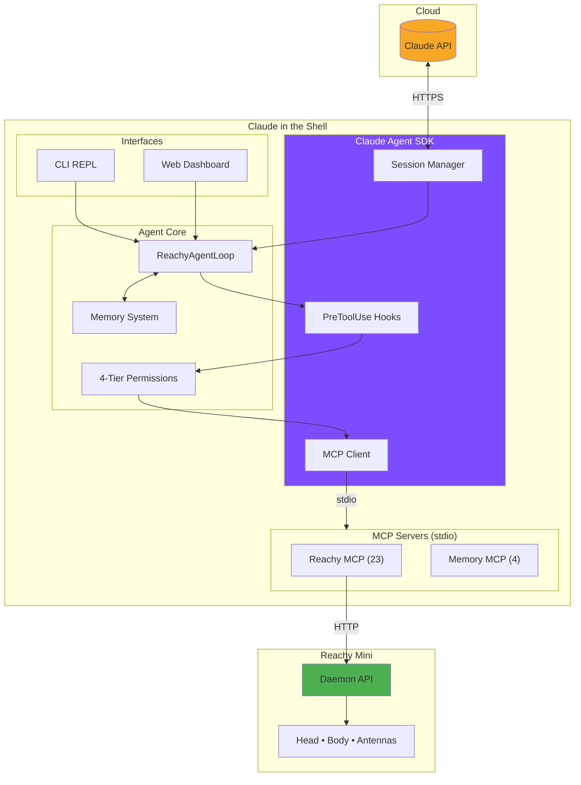
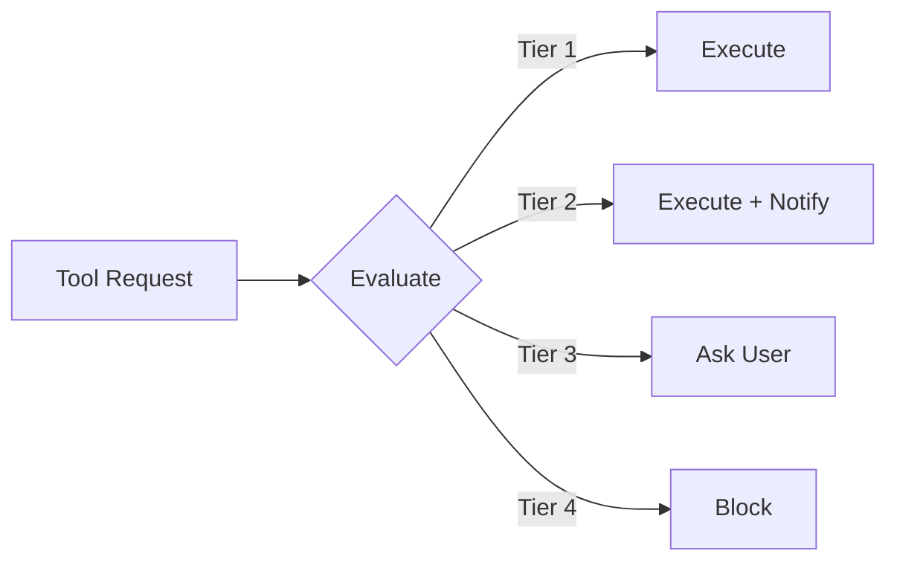

# Claude in the Shell

An embodied AI agent for the Reachy Mini desktop robot, powered by Claude Agent SDK and MCP.

> *"Your ghost, my shell."* - Inspired by Ghost in the Shell

**Status: Phase 1 Complete** | [Architecture Docs](docs/architecture/overview.md) | [Getting Started Tutorial](docs/tutorials/getting-started.md)

## Overview

Claude in the Shell transforms your Reachy Mini into an autonomous AI assistant that can:
- Respond to voice commands with "Hey Reachy" wake word
- Control its head, body, and antennas expressively
- See through its camera and respond to visual cues
- Remember context across conversations
- Connect to external services via MCP (Home Assistant, Calendar, GitHub, etc.)

## Architecture



See [Architecture Documentation](docs/architecture/overview.md) for detailed diagrams.

## Quick Start

### Prerequisites

- Python 3.10+
- uv (recommended) or pip
- Reachy Mini with Raspberry Pi 4, **or** MuJoCo for simulation

### Installation

```bash
# Clone the repository
git clone https://github.com/jawhnycooke/claude-in-the-shell.git
cd claude-in-the-shell

# Create virtual environment
uv venv && source .venv/bin/activate

# Install dependencies
uv pip install -r requirements.txt

# Copy environment template
cp .env.example .env
# Edit .env with your ANTHROPIC_API_KEY
```

### Simulation Mode (No Hardware Required)

Test the full stack with MuJoCo physics simulation:

```bash
# Terminal 1: Start simulation (macOS)
/opt/homebrew/bin/mjpython -m reachy_mini.daemon.app.main --sim --scene minimal --fastapi-port 8765

# Terminal 2: Run validation
python scripts/validate_mcp_e2e.py
```

See the [Getting Started Tutorial](docs/tutorials/getting-started.md) for complete setup instructions.

### Production Mode (Real Hardware)

On the Raspberry Pi with Reachy daemon running:

```bash
# Interactive agent (defaults to :8000 for production)
python -m reachy_agent run

# Rich terminal REPL (defaults to :8765 for simulation)
python -m reachy_agent repl

# Web dashboard (defaults to :8765 for simulation)
python -m reachy_agent web

# For production hardware, specify :8000
python -m reachy_agent repl --daemon-url http://localhost:8000

# Health check
python -m reachy_agent check
```

### Testing Without Hardware

```bash
# Run with mock daemon (no hardware or MuJoCo needed)
python -m reachy_agent run --mock
```

## Project Structure

```
claude-in-the-shell/
├── src/reachy_agent/
│   ├── agent/              # Agent loop with Claude SDK client
│   ├── behaviors/          # Idle behavior controller
│   ├── cli/                # CLI REPL interface
│   ├── errors/             # Error codes and responses
│   ├── expressions/        # Antenna/emotion sequences
│   ├── mcp_servers/        # MCP server implementations
│   │   ├── reachy/         # 23 robot control tools
│   │   ├── memory/         # 4 memory system tools
│   │   └── integrations/   # External service MCP servers
│   ├── memory/             # Memory manager (ChromaDB + SQLite)
│   │   └── storage/        # ChromaDB and SQLite backends
│   ├── perception/         # Wake word, audio, vision (Phase 2)
│   ├── permissions/        # 4-tier permission system
│   │   ├── handlers/       # CLI and WebSocket handlers
│   │   └── storage/        # SQLite audit logging
│   ├── privacy/            # Privacy indicators (Phase 2)
│   ├── resilience/         # Error recovery (Phase 2)
│   ├── simulation/         # MuJoCo simulation bridge
│   ├── web/                # FastAPI web dashboard
│   │   ├── routes/         # API and WebSocket routes
│   │   └── static/         # CSS and JavaScript assets
│   └── utils/              # Config, logging utilities
├── ai_docs/                # AI agent reference materials
├── config/                 # Configuration files (YAML)
├── docs/                   # MkDocs documentation
│   ├── api/                # Auto-generated API reference
│   ├── architecture/       # System design diagrams
│   ├── diagrams/           # Mermaid diagram source files
│   ├── guides/             # How-to guides
│   ├── planning/           # PRD, TRD, implementation docs
│   └── tutorials/          # Getting started guides
├── prompts/                # System prompt templates
│   ├── context/            # Context injection templates
│   ├── expressions/        # Expression prompt templates
│   ├── integrations/       # Integration prompts
│   └── system/             # Core system prompts
├── scripts/                # Validation & demo scripts
└── tests/                  # Test suite
    ├── integration/        # Integration tests
    ├── simulation/         # MuJoCo simulation tests
    └── unit/               # Unit tests
```

## MCP Tools

The agent exposes **27 tools** to Claude via two MCP servers, discovered dynamically via MCP protocol:

### Reachy MCP Server (23 tools)

| Category | Tools | Description |
|----------|-------|-------------|
| **Movement** (5) | `move_head`, `look_at`, `look_at_world`, `look_at_pixel`, `rotate` | Head/body positioning, IK |
| **Expression** (6) | `play_emotion`, `play_recorded_move`, `set_antenna_state`, `nod`, `shake`, `dance` | Emotions from HuggingFace SDK |
| **Audio** (2) | `speak`, `listen` | Speech I/O |
| **Perception** (3) | `capture_image`, `get_sensor_data`, `look_at_sound` | Sensors and camera |
| **Lifecycle** (3) | `wake_up`, `sleep`, `rest` | Power management |
| **Status** (2) | `get_status`, `get_pose` | Robot state feedback |
| **Control** (2) | `set_motor_mode`, `cancel_action` | Motor control, action cancellation |

### Memory MCP Server (4 tools)

| Tool | Description |
|------|-------------|
| `search_memories` | Semantic search over stored memories (ChromaDB) |
| `store_memory` | Save a new memory with type classification |
| `get_user_profile` | Retrieve user preferences and info (SQLite) |
| `update_user_profile` | Update user preferences |

See [MCP Tools Quick Reference](ai_docs/mcp-tools-quick-ref.md) for full parameter details.

## Permission System



| Tier | Behavior | Examples |
|------|----------|----------|
| 1. Autonomous | Execute immediately | Body control, reading data |
| 2. Notify | Execute and inform | Smart home control |
| 3. Confirm | Ask before executing | Creating events, PRs |
| 4. Forbidden | Never execute | Security-critical ops |

## Development

```bash
# Install dev dependencies
uv pip install -r requirements-dev.txt

# Run tests
pytest -v

# Format code
black . && isort .

# Type check
mypy src/

# Lint
ruff check .
```

## Documentation

| Document | Description |
|----------|-------------|
| [Getting Started Tutorial](docs/tutorials/getting-started.md) | Complete setup from scratch |
| [Architecture Overview](docs/architecture/overview.md) | System design with Mermaid diagrams |
| [MCP Tools Reference](ai_docs/mcp-tools-quick-ref.md) | All 23 robot control tools |
| [Memory System](ai_docs/memory-system.md) | Long-term memory with 4 MCP tools |
| [Development Commands](ai_docs/dev-commands.md) | Command cheat sheet |
| [Agent Behavior Guide](ai_docs/agent-behavior.md) | Personality and expression patterns |

## Project Status

### Phase 1: Foundation ✅ Complete
- [x] Project scaffolding and configuration
- [x] Reachy MCP server (23 tools with native SDK emotions)
- [x] Official Claude Agent SDK integration (`ClaudeSDKClient`)
- [x] 4-tier permission system with SDK PreToolUse hooks
- [x] MuJoCo simulation testing (238 tests)
- [x] Web dashboard with real-time control
- [x] CLI REPL interface
- [x] Idle behavior controller
- [x] End-to-end validation

### Phase 2: Hardware Integration (Next)
- [ ] Raspberry Pi environment setup
- [ ] Wake word detection (OpenWakeWord)
- [ ] Attention state machine (Passive/Alert/Engaged)
- [ ] Privacy indicators via antennas

### Phase 3: Memory & Personality (Partially Complete)
- [x] ChromaDB vector memory
- [x] SQLite structured storage (profiles, sessions)
- [x] Memory MCP tools (4 tools)
- [x] Auto-injection of user profile + last session
- [ ] Expression system
- [ ] Personality configuration

### Phase 4: External Integrations
- [ ] Home Assistant MCP
- [ ] Google Calendar MCP
- [ ] GitHub MCP
- [ ] Offline fallback (Ollama + Piper)

## License

MIT

## References

- [Reachy Mini SDK](https://github.com/pollen-robotics/reachy_mini) - Official Pollen Robotics SDK
- [Claude Agent SDK](https://github.com/anthropics/claude-agent-sdk-python) - Anthropic Agent SDK
- [MCP Python SDK](https://github.com/modelcontextprotocol/python-sdk) - Model Context Protocol
- [MuJoCo](https://mujoco.org/) - Physics simulation
