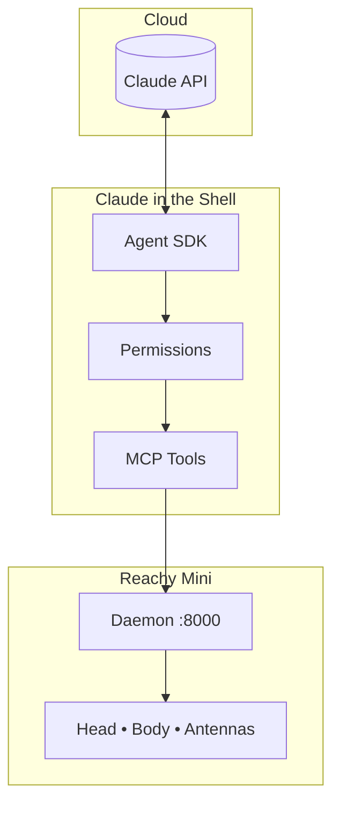
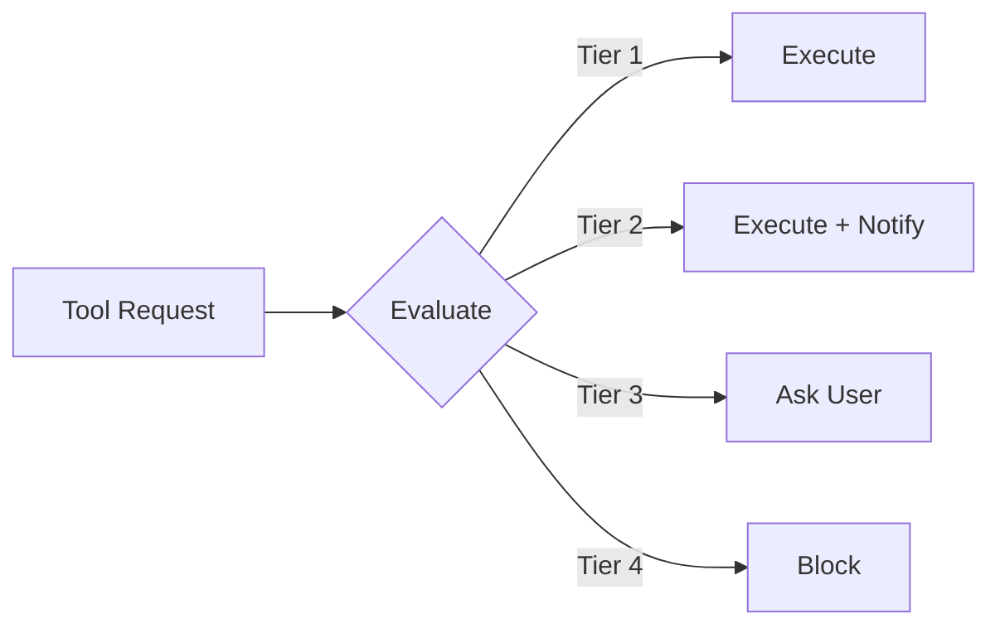

# Claude in the Shell

An embodied AI agent for the Reachy Mini desktop robot, powered by Claude Agent SDK and MCP.

> *"Your ghost, my shell."* - Inspired by Ghost in the Shell

**Status: Phase 1 Complete** | [Architecture Docs](docs/architecture/overview.md) | [Getting Started Tutorial](docs/tutorials/getting-started.md)

## Overview

Claude in the Shell transforms your Reachy Mini into an autonomous AI assistant that can:
- Respond to voice commands with "Hey Reachy" wake word
- Control its head, body, and antennas expressively
- See through its camera and respond to visual cues
- Remember context across conversations
- Connect to external services via MCP (Home Assistant, Calendar, GitHub, etc.)

## Architecture



See [Architecture Documentation](docs/architecture/overview.md) for detailed diagrams.

## Quick Start

### Prerequisites

- Python 3.10+
- uv (recommended) or pip
- Reachy Mini with Raspberry Pi 4, **or** MuJoCo for simulation

### Installation

```bash
# Clone the repository
git clone https://github.com/jawhnycooke/claude-in-the-shell.git
cd claude-in-the-shell

# Create virtual environment
uv venv && source .venv/bin/activate

# Install dependencies
uv pip install -r requirements.txt

# Copy environment template
cp .env.example .env
# Edit .env with your ANTHROPIC_API_KEY
```

### Simulation Mode (No Hardware Required)

Test the full stack with MuJoCo physics simulation:

```bash
# Terminal 1: Start simulation (macOS)
/opt/homebrew/bin/mjpython -m reachy_mini.daemon.app.main --sim --scene minimal --fastapi-port 8765

# Terminal 2: Run validation
python scripts/validate_mcp_e2e.py
```

See the [Getting Started Tutorial](docs/tutorials/getting-started.md) for complete setup instructions.

### Production Mode (Real Hardware)

On the Raspberry Pi with Reachy daemon running:

```bash
python -m reachy_agent run
```

## Project Structure

```
claude-in-the-shell/
├── src/reachy_agent/
│   ├── agent/              # Claude Agent SDK integration
│   ├── mcp_servers/        # MCP server implementations
│   │   └── reachy/         # 16 robot control tools
│   ├── permissions/        # 4-tier permission system
│   ├── simulation/         # MuJoCo simulation bridge
│   └── utils/              # Config, logging
├── config/                 # Configuration files
├── prompts/                # System prompts (externalized)
├── docs/                   # Documentation
│   ├── tutorials/          # Getting started guides
│   ├── architecture/       # System design
│   └── api/                # API reference
├── tests/                  # Test suite
└── scripts/                # Validation & demo scripts
```

## MCP Tools

The Reachy MCP server exposes 16 tools to Claude:

| Category | Tools | Description |
|----------|-------|-------------|
| **Movement** | `move_head`, `look_at`, `rotate` | Head and body positioning |
| **Expression** | `play_emotion`, `set_antenna_state`, `nod`, `shake` | Emotional expression |
| **Audio** | `speak`, `play_sound` | Speech and audio output |
| **Perception** | `capture_image`, `get_sensor_data`, `look_at_sound` | Sensors and camera |
| **Lifecycle** | `wake_up`, `sleep`, `rest` | Power management |
| **Actions** | `dance` | Choreographed routines |

## Permission System



| Tier | Behavior | Examples |
|------|----------|----------|
| 1. Autonomous | Execute immediately | Body control, reading data |
| 2. Notify | Execute and inform | Smart home control |
| 3. Confirm | Ask before executing | Creating events, PRs |
| 4. Forbidden | Never execute | Security-critical ops |

## Development

```bash
# Install dev dependencies
uv pip install -r requirements-dev.txt

# Run tests
pytest -v

# Format code
black . && isort .

# Type check
mypy src/

# Lint
ruff check .
```

## Documentation

| Document | Description |
|----------|-------------|
| [Getting Started Tutorial](docs/tutorials/getting-started.md) | Complete setup from scratch |
| [Quick Reference](docs/tutorials/quick-reference.md) | Command cheat sheet |
| [Architecture Overview](docs/architecture/overview.md) | System design with Mermaid diagrams |
| [MCP Tools Reference](docs/api/mcp-tools.md) | All 16 available tools |
| [Phase 2 Preparation](docs/guides/phase2-preparation.md) | Hardware integration guide |

## Project Status

### Phase 1: Foundation ✅ Complete
- [x] Project scaffolding and configuration
- [x] Reachy MCP server (16 tools)
- [x] Claude Agent SDK integration
- [x] 4-tier permission system
- [x] MuJoCo simulation testing
- [x] End-to-end validation

### Phase 2: Hardware Integration (Next)
- [ ] Raspberry Pi environment setup
- [ ] Wake word detection (OpenWakeWord)
- [ ] Attention state machine (Passive/Alert/Engaged)
- [ ] Privacy indicators via antennas

### Phase 3: Memory & Personality
- [ ] ChromaDB vector memory
- [ ] SQLite structured storage
- [ ] Expression system
- [ ] Personality configuration

### Phase 4: External Integrations
- [ ] Home Assistant MCP
- [ ] Google Calendar MCP
- [ ] GitHub MCP
- [ ] Offline fallback (Ollama + Piper)

## License

MIT

## References

- [Reachy Mini SDK](https://github.com/pollen-robotics/reachy_mini) - Official Pollen Robotics SDK
- [Claude Agent SDK](https://github.com/anthropics/claude-agent-sdk-python) - Anthropic Agent SDK
- [MCP Python SDK](https://github.com/modelcontextprotocol/python-sdk) - Model Context Protocol
- [MuJoCo](https://mujoco.org/) - Physics simulation
