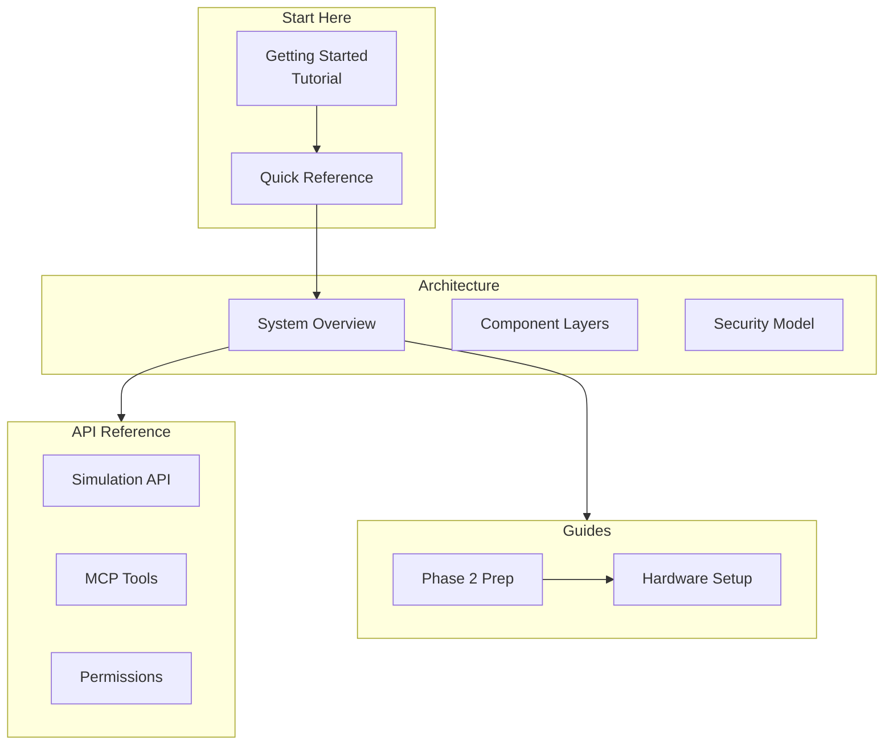
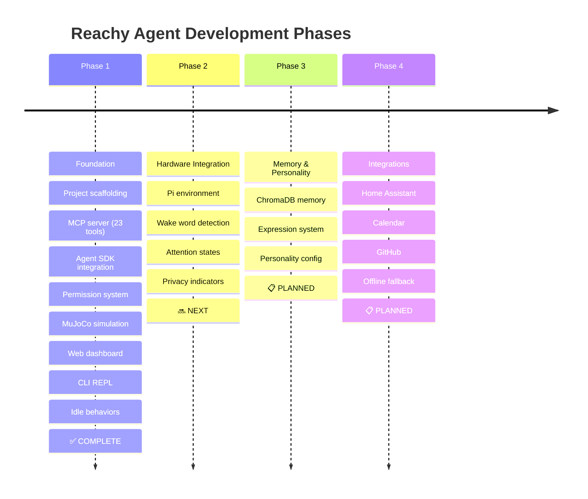

# Reachy Agent Documentation

Welcome to the Reachy Agent documentation. This guide covers the architecture, APIs, and guides for building and deploying an embodied AI agent on the Reachy Mini robot.

## Documentation Map



## Quick Links

| I want to... | Go to... |
|-------------|----------|
| **Get started from scratch** | [Getting Started Tutorial](tutorials/getting-started.md) |
| **Quick command reference** | [Quick Reference Card](tutorials/quick-reference.md) |
| Understand the system design | [Architecture Overview](architecture/overview.md) |
| Test with MuJoCo simulation | [Simulation API](api/simulation.md) |
| Prepare for hardware setup | [Phase 2 Guide](guides/phase2-preparation.md) |
| See available MCP tools | [MCP Tools Reference](../ai_docs/mcp-tools-quick-ref.md) |
| Configure permissions | [Permission System](api/permissions.md) |

## Documentation Structure

```
docs/
├── README.md                    # This file
├── tutorials/                   # Learning-oriented guides
│   └── getting-started.md       # Complete setup tutorial
├── architecture/
│   └── overview.md              # System design with diagrams
├── api/
│   └── mcp-tools.md             # Legacy (see ai_docs/ for current)
├── planning/                    # Historical planning documents
│   ├── PRD.md                   # Product requirements
│   ├── TECH_REQ.md              # Technical requirements
│   └── EPCC_*.md                # Implementation logs
└── guides/
    └── phase2-preparation.md    # Hardware integration prep

ai_docs/                         # Current AI agent reference
├── mcp-tools-quick-ref.md       # All 23 MCP tools
├── architecture.md              # System architecture
├── dev-commands.md              # Development commands
├── agent-behavior.md            # Personality guidelines
└── code-standards.md            # Code quality standards
```

## Project Documents

These documents live in the project root:

| Document | Purpose |
|----------|---------|
| [README.md](../README.md) | Project overview and quick start |
| [CLAUDE.md](../CLAUDE.md) | Instructions for Claude Code |

Historical planning documents are in `docs/planning/`:

| Document | Purpose |
|----------|---------|
| [EPCC_PLAN.md](planning/EPCC_PLAN.md) | Full implementation roadmap |
| [TECH_REQ.md](planning/TECH_REQ.md) | Technical requirements and decisions |
| [PRD.md](planning/PRD.md) | Product requirements document |

## Phase Status



## Contributing

When adding documentation:

1. Use Mermaid diagrams for visual explanations
2. Include code examples that can be copy-pasted
3. Add troubleshooting sections for complex features
4. Update this index when adding new documents
