# Reachy Agent Documentation

Welcome to the Reachy Agent documentation. This guide covers the architecture, APIs, and guides for building and deploying an embodied AI agent on the Reachy Mini robot.

## Documentation Map


## Quick Links

| I want to... | Go to... |
|-------------|----------|
| **Get started from scratch** | [Getting Started Tutorial](tutorials/getting-started.md) |
| **Quick command reference** | [Quick Reference Card](tutorials/quick-reference.md) |
| Understand the system design | [Architecture Overview](architecture/overview.md) |
| Test with MuJoCo simulation | [Simulation API](api/simulation.md) |
| Prepare for hardware setup | [Phase 2 Guide](guides/phase2-preparation.md) |
| See available MCP tools | [MCP Tools Reference](api/mcp-tools.md) |
| Configure permissions | [Permission System](api/permissions.md) |

## Documentation Structure

```
docs/
├── README.md                    # This file
├── tutorials/                   # Learning-oriented guides
│   ├── getting-started.md       # Complete setup tutorial
│   └── quick-reference.md       # Command cheat sheet
├── architecture/
│   └── overview.md              # System design with diagrams
├── api/
│   ├── simulation.md            # SimulationAdapter, ReachyMiniClient
│   ├── mcp-tools.md             # All 16 MCP tools
│   └── permissions.md           # Permission tiers (TODO)
└── guides/
    └── phase2-preparation.md    # Hardware integration prep
```

## Project Documents

These documents live in the project root:

| Document | Purpose |
|----------|---------|
| [README.md](../README.md) | Project overview and quick start |
| [CLAUDE.md](../CLAUDE.md) | Instructions for Claude Code |
| [EPCC_PLAN.md](../EPCC_PLAN.md) | Full implementation roadmap |
| [TECH_REQ.md](../TECH_REQ.md) | Technical requirements and decisions |
| [PRD.md](../PRD.md) | Product requirements document |

## Phase Status

```mermaid
timeline
    title Reachy Agent Development Phases

    Phase 1 : Foundation
            : Project scaffolding
            : MCP server (16 tools)
            : Agent SDK integration
            : Permission system
            : MuJoCo simulation
            : ✅ COMPLETE

    Phase 2 : Hardware Integration
            : Pi environment
            : Wake word detection
            : Attention states
            : Privacy indicators
            : 🔜 NEXT

    Phase 3 : Memory & Personality
            : ChromaDB memory
            : Expression system
            : Personality config
            : 📋 PLANNED

    Phase 4 : Integrations
            : Home Assistant
            : Calendar
            : GitHub
            : Offline fallback
            : 📋 PLANNED
```



## Contributing

When adding documentation:

1. Use Mermaid diagrams for visual explanations
2. Include code examples that can be copy-pasted
3. Add troubleshooting sections for complex features
4. Update this index when adding new documents
