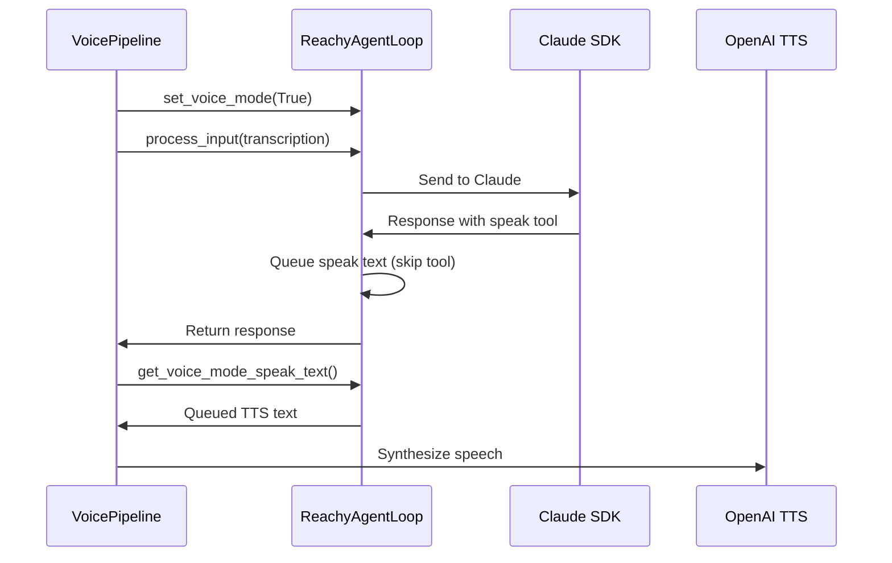
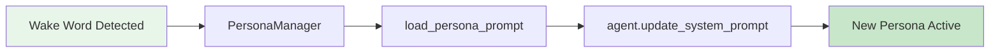

# Agent Module API

The agent module provides the core agent loop implementation using the Claude Agent SDK.

## ReachyAgentLoop

::: reachy_agent.agent.agent.ReachyAgentLoop
    options:
      show_source: true
      members:
        - __init__
        - initialize
        - shutdown
        - process_input
        - session

## AgentState

::: reachy_agent.agent.agent.AgentState

## AgentContext

::: reachy_agent.agent.agent.AgentContext

## AgentResponse

::: reachy_agent.agent.agent.AgentResponse

## Voice Mode Methods

Methods for integrating with the voice pipeline and persona system.

### set_voice_mode

Enable or disable voice mode for TTS integration.

```python
def set_voice_mode(self, enabled: bool) -> None:
    """Enable or disable voice mode.

    When voice mode is enabled, the `speak` tool is skipped because
    responses are synthesized via the voice pipeline's OpenAI TTS.
    """
```

### get_voice_mode_speak_text

Retrieve captured speak tool text for TTS synthesis.

```python
def get_voice_mode_speak_text(self) -> str:
    """Get captured speak tool text and clear the queue.

    In voice mode, speak tool calls are intercepted and their text
    is queued for TTS synthesis by the voice pipeline.

    Returns:
        Concatenated text from speak tool calls, or empty string.
    """
```

### update_system_prompt

Update the system prompt for persona switching.

```python
async def update_system_prompt(self, new_prompt: str) -> bool:
    """Update the system prompt for persona switching.

    Used by the voice pipeline for Ghost in the Shell themed personas
    (Motoko/Batou). Requires an active SDK session.

    Args:
        new_prompt: New system prompt to use.

    Returns:
        True if updated successfully, False otherwise.
    """
```

### set_listening_state

Control antenna freeze during user speech.

```python
def set_listening_state(self, listening: bool) -> None:
    """Set whether the robot is listening to the user.

    When listening, antenna motion is frozen via the blend controller
    to avoid distraction while the user speaks.
    """
```

## Usage Example

```python
from reachy_agent.agent.agent import ReachyAgentLoop

# Using context manager (recommended)
async with ReachyAgentLoop(
    daemon_url="http://localhost:8765",
    enable_memory=True,
).session() as agent:
    response = await agent.process_input("Hello, Reachy!")
    print(response.text)

# Manual lifecycle
agent = ReachyAgentLoop(daemon_url="http://localhost:8765")
await agent.initialize()
try:
    response = await agent.process_input("Wave at me!")
    if response.success:
        print(response.text)
finally:
    await agent.shutdown()
```

## Configuration

The agent can be configured via:

- Constructor parameters
- `config/default.yaml`
- Environment variables

See [Options Module](#options-module) for configuration details.

## Options Module

::: reachy_agent.agent.options
    options:
      show_source: true
      members:
        - load_system_prompt
        - load_persona_prompt
        - build_sdk_agent_options

## Voice Mode Integration

The agent integrates with the voice pipeline for real-time voice interaction:



### Persona Switching

When a new wake word is detected, the voice pipeline switches personas:


