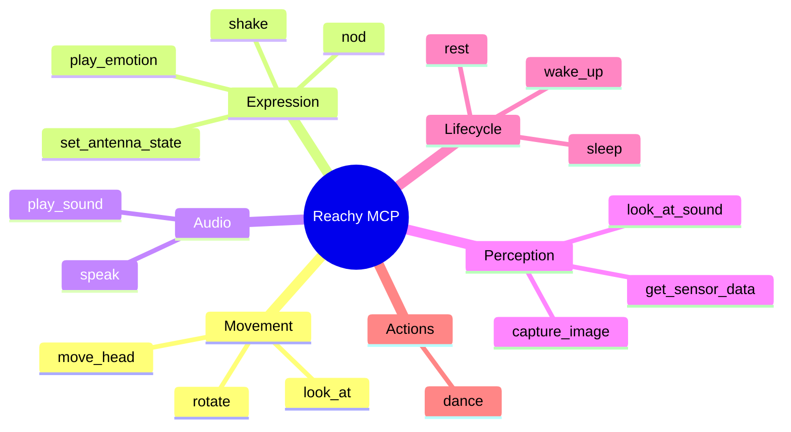
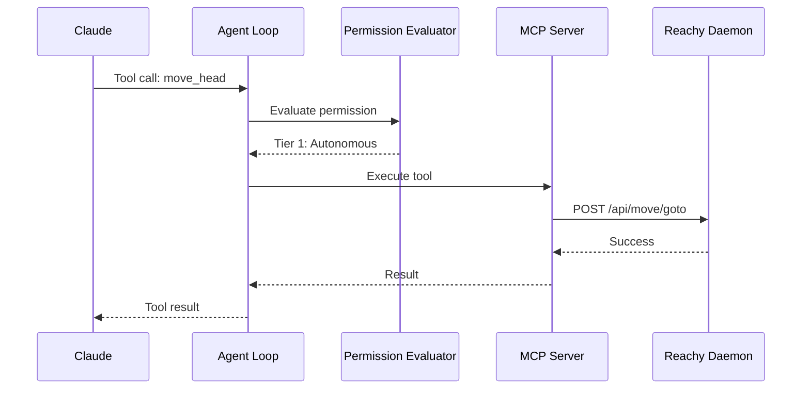

# MCP Tools Reference

The Reachy MCP server exposes 16 tools that Claude can use to control the robot. This document provides a complete reference for all available tools.

## Tool Categories



## Movement Tools

### move_head

Move the robot's head in a cardinal direction.

```yaml
tool: move_head
permission_tier: 1 (Autonomous)
```

**Parameters:**

| Parameter | Type | Required | Default | Description |
|-----------|------|----------|---------|-------------|
| `direction` | string | Yes | - | One of: `left`, `right`, `up`, `down`, `front` |
| `speed` | string | No | `normal` | One of: `slow`, `normal`, `fast` |
| `degrees` | number | No | 30 | Angle in degrees (0-90) |

**Example:**
```json
{
  "tool": "move_head",
  "input": {
    "direction": "left",
    "speed": "fast",
    "degrees": 45
  }
}
```

**Response:**
```json
{
  "status": "ok",
  "message": "Head moved left by 45 degrees",
  "uuid": "a1b2c3d4-..."
}
```

### look_at

Position the head with precise Euler angles.

```yaml
tool: look_at
permission_tier: 1 (Autonomous)
```

**Parameters:**

| Parameter | Type | Required | Default | Description |
|-----------|------|----------|---------|-------------|
| `roll` | number | No | 0 | Tilt left/right in degrees |
| `pitch` | number | No | 0 | Up (negative) / Down (positive) |
| `yaw` | number | No | 0 | Left (positive) / Right (negative) |
| `z` | number | No | 0 | Vertical offset (limited use) |

**Example:**
```json
{
  "tool": "look_at",
  "input": {
    "roll": 0,
    "pitch": -15,
    "yaw": 30
  }
}
```

### rotate

Rotate the robot's body.

```yaml
tool: rotate
permission_tier: 1 (Autonomous)
```

**Parameters:**

| Parameter | Type | Required | Default | Description |
|-----------|------|----------|---------|-------------|
| `direction` | string | Yes | - | One of: `left`, `right` |
| `degrees` | number | No | 90 | Rotation amount (0-360) |
| `speed` | string | No | `normal` | One of: `slow`, `normal`, `fast` |

## Expression Tools

### play_emotion

Trigger a predefined emotion sequence.

```yaml
tool: play_emotion
permission_tier: 1 (Autonomous)
```

**Parameters:**

| Parameter | Type | Required | Default | Description |
|-----------|------|----------|---------|-------------|
| `emotion` | string | Yes | - | See emotion list below |
| `intensity` | number | No | 0.7 | Intensity from 0.0 to 1.0 |

**Available Emotions:**

| Emotion | Description |
|---------|-------------|
| `happy` | Antennas up, slight nod |
| `sad` | Antennas down, head droops |
| `curious` | Head tilt, one antenna up |
| `surprised` | Quick antenna movement |
| `thinking` | Slow side-to-side |
| `confused` | Head tilt, antenna wiggle |
| `excited` | Rapid antenna movement |
| `sleepy` | Slow droop, eyes close |
| `greeting` | Head nod, antennas wave |
| `acknowledge` | Quick nod |

**Example:**
```json
{
  "tool": "play_emotion",
  "input": {
    "emotion": "curious",
    "intensity": 0.8
  }
}
```

### set_antenna_state

Fine-grained control of antenna positions.

```yaml
tool: set_antenna_state
permission_tier: 1 (Autonomous)
```

**Parameters:**

| Parameter | Type | Required | Default | Description |
|-----------|------|----------|---------|-------------|
| `left_angle` | number | No | 45 | Left antenna angle (0-90 degrees) |
| `right_angle` | number | No | 45 | Right antenna angle (0-90 degrees) |
| `wiggle` | boolean | No | false | Add subtle movement |
| `duration_ms` | number | No | 500 | Movement duration in ms |

**Antenna Semantics:**

| Position | Meaning |
|----------|---------|
| Both at 0° | Passive/sleeping |
| Both at 45° | Alert/neutral |
| Both at 90° | Engaged/listening |
| Asymmetric | Curious/confused |
| Wiggling | Processing/thinking |

### nod

Perform a nodding gesture (affirmative).

```yaml
tool: nod
permission_tier: 1 (Autonomous)
```

**Parameters:**

| Parameter | Type | Required | Default | Description |
|-----------|------|----------|---------|-------------|
| `times` | number | No | 2 | Number of nods (1-5) |
| `speed` | string | No | `normal` | One of: `slow`, `normal`, `fast` |

### shake

Perform a head shake gesture (negative).

```yaml
tool: shake
permission_tier: 1 (Autonomous)
```

**Parameters:**

| Parameter | Type | Required | Default | Description |
|-----------|------|----------|---------|-------------|
| `times` | number | No | 2 | Number of shakes (1-5) |
| `speed` | string | No | `normal` | One of: `slow`, `normal`, `fast` |

## Audio Tools

### speak

Output speech through the robot's speaker.

```yaml
tool: speak
permission_tier: 1 (Autonomous)
```

**Parameters:**

| Parameter | Type | Required | Default | Description |
|-----------|------|----------|---------|-------------|
| `text` | string | Yes | - | Text to speak (max 500 chars) |
| `voice` | string | No | `default` | Voice preset |
| `speed` | number | No | 1.0 | Speech rate (0.5-2.0) |
| `pitch` | number | No | 1.0 | Voice pitch (0.5-2.0) |

**Example:**
```json
{
  "tool": "speak",
  "input": {
    "text": "Hello! I'm Reachy, your robot assistant.",
    "speed": 1.1
  }
}
```

### play_sound

Play a sound effect.

```yaml
tool: play_sound
permission_tier: 1 (Autonomous)
```

**Parameters:**

| Parameter | Type | Required | Default | Description |
|-----------|------|----------|---------|-------------|
| `sound` | string | Yes | - | Sound name or path |
| `volume` | number | No | 0.8 | Volume (0.0-1.0) |

**Built-in Sounds:**

| Sound | Description |
|-------|-------------|
| `beep` | Simple beep |
| `chime` | Pleasant chime |
| `alert` | Attention sound |
| `confirm` | Confirmation tone |
| `error` | Error indicator |

## Perception Tools

### capture_image

Capture a frame from the robot's camera.

```yaml
tool: capture_image
permission_tier: 1 (Autonomous)
```

**Parameters:**

| Parameter | Type | Required | Default | Description |
|-----------|------|----------|---------|-------------|
| `format` | string | No | `jpeg` | One of: `jpeg`, `png` |
| `quality` | number | No | 85 | JPEG quality (1-100) |
| `resize` | object | No | - | Resize options |

**Response:**
```json
{
  "status": "ok",
  "image": "base64-encoded-data...",
  "width": 640,
  "height": 480,
  "timestamp": "2024-12-20T12:00:00Z"
}
```

### get_sensor_data

Read sensor values.

```yaml
tool: get_sensor_data
permission_tier: 1 (Autonomous)
```

**Parameters:**

| Parameter | Type | Required | Default | Description |
|-----------|------|----------|---------|-------------|
| `sensors` | array | No | all | Sensors to read |

**Available Sensors:**

| Sensor | Data |
|--------|------|
| `imu` | Accelerometer, gyroscope |
| `audio_level` | Ambient audio level (dB) |
| `temperature` | Internal temperature |
| `battery` | Battery level (if wireless) |
| `position` | Current motor positions |

**Example Response:**
```json
{
  "status": "ok",
  "imu": {
    "accel": [0.01, 0.02, 9.81],
    "gyro": [0.0, 0.0, 0.0]
  },
  "audio_level": 42.5,
  "temperature": 38.2
}
```

### look_at_sound

Turn the head toward a detected sound source.

```yaml
tool: look_at_sound
permission_tier: 1 (Autonomous)
```

**Parameters:**

| Parameter | Type | Required | Default | Description |
|-----------|------|----------|---------|-------------|
| `threshold_db` | number | No | 50 | Minimum sound level to trigger |
| `timeout_ms` | number | No | 3000 | Max wait time for sound |

**Response:**
```json
{
  "status": "ok",
  "detected": true,
  "direction": 45,
  "confidence": 0.85
}
```

## Lifecycle Tools

### wake_up

Activate the robot (enable motors, ready position).

```yaml
tool: wake_up
permission_tier: 1 (Autonomous)
```

**Parameters:** None

**Response:**
```json
{
  "status": "ok",
  "message": "Robot is now awake",
  "uuid": "..."
}
```

### sleep

Deactivate the robot (safe position, disable motors).

```yaml
tool: sleep
permission_tier: 1 (Autonomous)
```

**Parameters:** None

### rest

Return to neutral resting pose without disabling motors.

```yaml
tool: rest
permission_tier: 1 (Autonomous)
```

**Parameters:** None

## Action Tools

### dance

Execute a choreographed movement routine.

```yaml
tool: dance
permission_tier: 1 (Autonomous)
```

**Parameters:**

| Parameter | Type | Required | Default | Description |
|-----------|------|----------|---------|-------------|
| `routine` | string | Yes | - | Dance routine name |
| `duration` | number | No | 10 | Max duration in seconds |

**Available Routines:**

| Routine | Description |
|---------|-------------|
| `wiggle` | Side-to-side wiggle |
| `happy_dance` | Excited movement |
| `groove` | Rhythmic movement |
| `wave` | Antenna wave |

## Error Handling

All tools return errors in a consistent format:

```json
{
  "status": "error",
  "error": "Error message",
  "code": "ERROR_CODE"
}
```

**Common Error Codes:**

| Code | Description |
|------|-------------|
| `INVALID_PARAMETER` | Invalid parameter value |
| `HARDWARE_ERROR` | Hardware communication failed |
| `TIMEOUT` | Operation timed out |
| `NOT_READY` | Robot not in ready state |
| `PERMISSION_DENIED` | Action not permitted |

## Permission Integration



All body control tools are Tier 1 (Autonomous) by default. See [Permission System](permissions.md) for customization.
