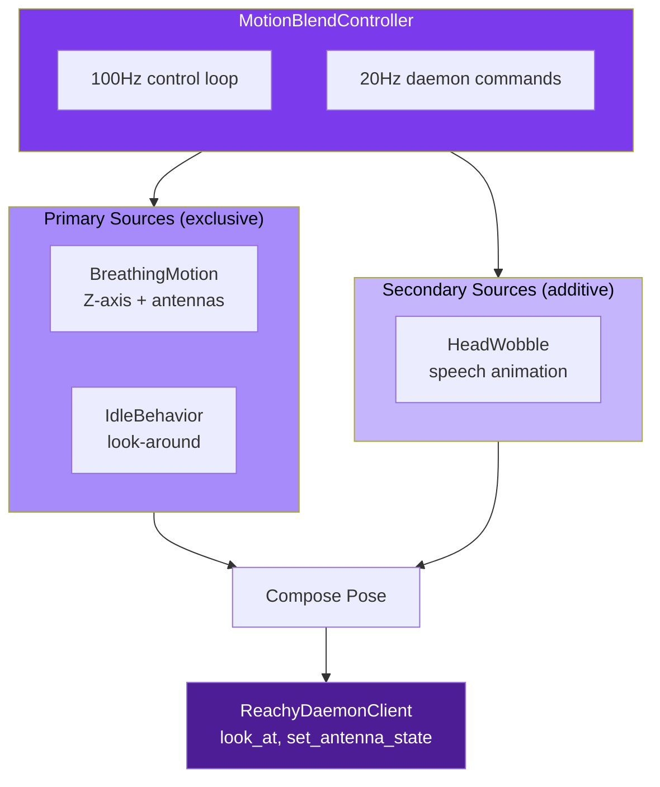
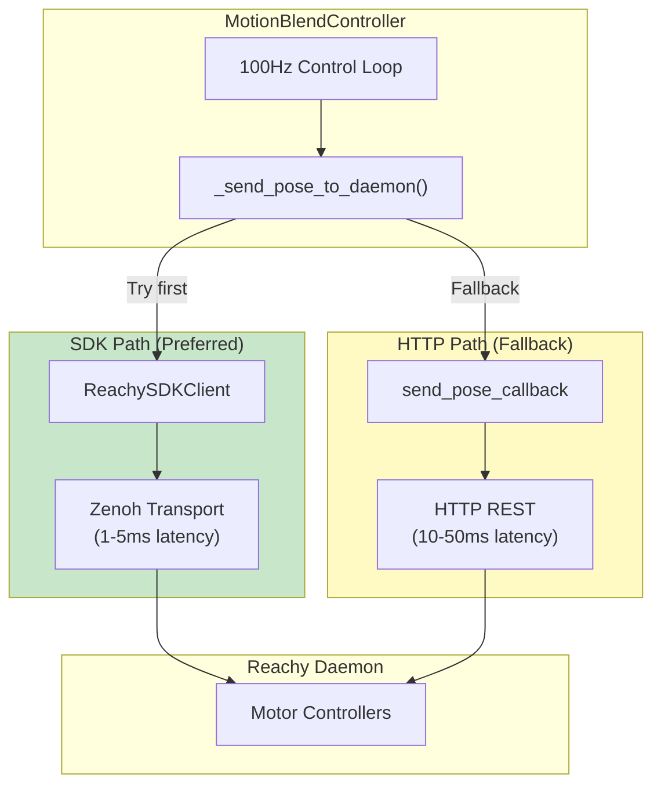
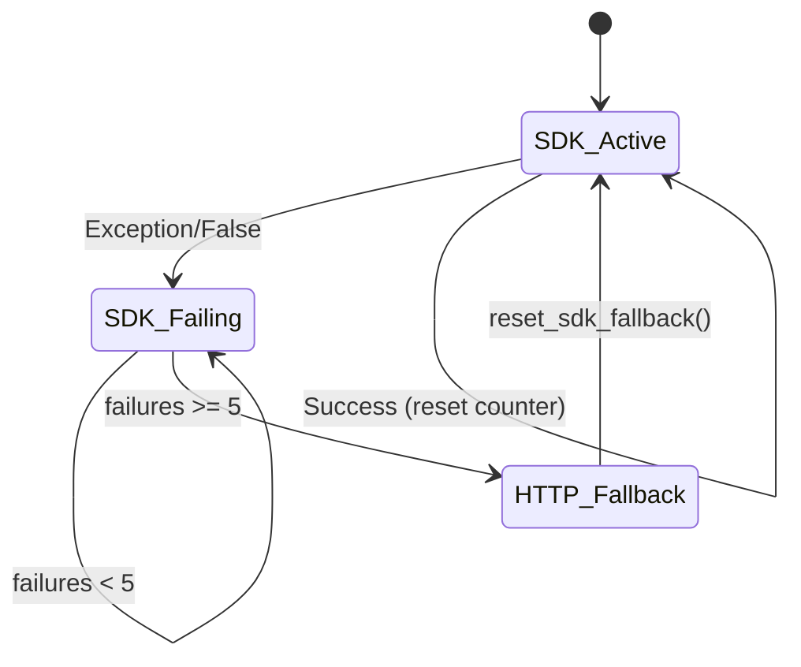

# Motion Blending API

The motion blending system orchestrates multiple motion sources to create natural, lifelike robot movements. It uses a priority-based composition model where primary motions are exclusive and secondary motions are additive overlays.

## Architecture Overview



## Core Types

### HeadPose

Complete pose snapshot representing all controllable head axes.

::: reachy_agent.behaviors.motion_types.HeadPose
    options:
      show_source: true
      members:
        - neutral
        - lerp
        - clamp
        - __add__

### PoseOffset

Delta values for secondary (additive) motions.

::: reachy_agent.behaviors.motion_types.PoseOffset
    options:
      show_source: true

### PoseLimits

Safety bounds for all pose axes.

::: reachy_agent.behaviors.motion_types.PoseLimits
    options:
      show_source: true

### MotionPriority

Enum defining motion source priority levels.

::: reachy_agent.behaviors.motion_types.MotionPriority

### MotionSource Protocol

Protocol that all motion sources must implement.

::: reachy_agent.behaviors.motion_types.MotionSource
    options:
      show_source: true

## MotionBlendController

The central orchestrator that composes motion sources and sends commands to the daemon.

::: reachy_agent.behaviors.blend_controller.MotionBlendController
    options:
      show_source: true
      members:
        - __init__
        - start
        - stop
        - register_source
        - unregister_source
        - set_primary
        - enable_secondary
        - disable_secondary
        - set_listening
        - get_status

### BlendControllerConfig

::: reachy_agent.behaviors.blend_controller.BlendControllerConfig
    options:
      show_source: true

## BreathingMotion

Subtle idle animation with Z-axis oscillation and antenna sway.

::: reachy_agent.behaviors.breathing.BreathingMotion
    options:
      show_source: true
      members:
        - __init__
        - start
        - stop
        - get_contribution

### BreathingConfig

::: reachy_agent.behaviors.breathing.BreathingConfig
    options:
      show_source: true

## HeadWobble

Audio-reactive motion for natural speech animation.

::: reachy_agent.behaviors.wobble.HeadWobble
    options:
      show_source: true
      members:
        - __init__
        - start
        - stop
        - push_audio
        - get_contribution
        - simulate_speech

### WobbleConfig

::: reachy_agent.behaviors.wobble.WobbleConfig
    options:
      show_source: true

## IdleBehaviorController

Look-around behavior when the robot is idle.

::: reachy_agent.behaviors.idle.IdleBehaviorController
    options:
      show_source: true
      members:
        - __init__
        - start
        - stop
        - pause
        - resume
        - notify_interaction
        - get_contribution

## Usage Examples

### Basic Motion Blending

```python
from reachy_agent.behaviors.blend_controller import (
    MotionBlendController,
    BlendControllerConfig,
)
from reachy_agent.behaviors.breathing import BreathingMotion, BreathingConfig
from reachy_agent.behaviors.wobble import HeadWobble, WobbleConfig
from reachy_agent.behaviors.motion_types import HeadPose

# Create controller with pose callback
async def send_pose(pose: HeadPose) -> None:
    await daemon_client.look_at(
        pitch=pose.pitch,
        yaw=pose.yaw,
        roll=pose.roll,
    )
    await daemon_client.set_antenna_state(
        left_angle=pose.left_antenna,
        right_angle=pose.right_antenna,
    )

config = BlendControllerConfig(
    tick_rate_hz=100.0,
    command_rate_hz=20.0,
    smoothing_factor=0.3,
)
controller = MotionBlendController(config, send_pose_callback=send_pose)

# Register motion sources
breathing = BreathingMotion(BreathingConfig())
wobble = HeadWobble(WobbleConfig())

controller.register_source("breathing", breathing)
controller.register_source("wobble", wobble)

# Start with breathing as primary
await controller.start()
await controller.set_primary("breathing")

# Enable wobble overlay during speech
await controller.enable_secondary("wobble")
wobble.simulate_speech(duration=2.0)  # For testing

# Freeze antennas while user speaks
controller.set_listening(True)
# ... user speaks ...
controller.set_listening(False)

# Cleanup
await controller.stop()
```

### Standalone Breathing Demo

```python
from reachy_agent.behaviors.breathing import run_breathing_demo

# Run breathing animation for 30 seconds
await run_breathing_demo(
    daemon_url="http://localhost:8765",
    duration_seconds=30.0,
)
```

### Standalone Idle Demo

```python
from reachy_agent.behaviors.idle import run_idle_demo

# Run idle look-around for 30 seconds
await run_idle_demo(
    daemon_url="http://localhost:8765",
    duration_seconds=30.0,
)
```

## Configuration

Motion blending can be configured via `config/default.yaml`:

```yaml
motion_blend:
  enabled: true
  tick_rate_hz: 100.0
  command_rate_hz: 20.0
  smoothing_factor: 0.3
  pose_limits:
    pitch_range: [-45.0, 45.0]
    yaw_range: [-45.0, 45.0]
    roll_range: [-30.0, 30.0]
    z_range: [-50.0, 50.0]
    antenna_range: [0.0, 90.0]

breathing:
  enabled: true
  z_amplitude_mm: 5.0
  z_frequency_hz: 0.15
  antenna_amplitude_deg: 10.0
  antenna_frequency_hz: 0.2
  antenna_base_angle: 45.0

wobble:
  enabled: true
  max_pitch_deg: 8.0
  max_yaw_deg: 5.0
  pitch_scale: 1.0
  yaw_scale: 0.6
  smoothing_factor: 0.3
  noise_frequency: 3.0

idle_behavior:
  enabled: true
  min_look_interval: 3.0
  max_look_interval: 8.0
  movement_duration: 1.5
  yaw_range: [-35.0, 35.0]
  pitch_range: [-15.0, 20.0]
  roll_range: [-8.0, 8.0]
  curiosity_chance: 0.15
  pause_on_interaction: true
```

## Design Patterns

### Primary vs Secondary Motions

- **Primary (Exclusive)**: Only one active at a time. Provides complete pose values.
  - Examples: Breathing, Idle look-around, Playing emotions
  - Use `set_primary()` to switch between them

- **Secondary (Additive)**: Multiple can be active simultaneously. Provides delta offsets.
  - Examples: Speech wobble, Face tracking adjustments
  - Use `enable_secondary()` / `disable_secondary()`

### Composition Model

```
final_pose = primary_pose + secondary_offset_1 + secondary_offset_2 + ...
```

The blend controller:
1. Gets the active primary source's complete `HeadPose`
2. Accumulates all active secondary sources' `PoseOffset` deltas
3. Adds offsets to the primary pose
4. Applies safety limits via `clamp()`
5. Smoothly interpolates toward target using `lerp()`
6. Sends final pose to daemon at command rate

### Listening State

When `set_listening(True)` is called, antenna positions are frozen to avoid distracting movements while the user speaks. Head movement continues normally.

## SDK Motion Control Integration

The blend controller supports two motion backends with automatic failover:

### Latency Comparison

| Backend | Transport | Latency | Use Case |
|---------|-----------|---------|----------|
| **SDK (Zenoh)** | Pub/Sub | 1-5ms | Preferred for smooth animation |
| **HTTP (REST)** | TCP/HTTP | 10-50ms | Fallback when SDK unavailable |

### Architecture



### Circuit Breaker Pattern

The SDK connection uses a circuit breaker to automatically fallback to HTTP:



- **Failure threshold**: 5 consecutive failures
- **Recovery**: Call `reset_sdk_fallback()` or restart controller
- **Logging**: Warnings emitted at threshold

### SDK Client API

```python
from reachy_agent.mcp_servers.reachy.sdk_client import ReachySDKClient

# Initialize with SDK client for low-latency motion
sdk_client = ReachySDKClient(config)
await sdk_client.connect()

controller = MotionBlendController(
    config=BlendControllerConfig(),
    send_pose_callback=http_fallback,  # Optional HTTP fallback
    sdk_client=sdk_client,              # Preferred SDK client
)
```

### Coordinate Transformations

The SDK client handles coordinate system differences:

| Component | Agent Format | SDK Format |
|-----------|--------------|------------|
| Head angles | Degrees | Radians + 4x4 matrix |
| Antennas | 0° = flat | 0 rad = vertical |

```python
# Agent pose (degrees, 0° = flat antennas)
pose = HeadPose(pitch=15.0, yaw=-10.0, left_antenna=45.0, right_antenna=45.0)

# SDK client converts internally:
# - pitch/yaw → rotation matrix via scipy.spatial.transform.Rotation
# - antennas: 45° → π/4 rad, inverted (SDK 0 = vertical)
await sdk_client.set_pose(pose)
```

### Configuration

```yaml
sdk:
  enabled: true
  robot_name: "reachy_mini"
  localhost_only: true
  spawn_daemon: false
  media_backend: "no_media"
  connect_timeout: 5.0
  fallback_to_http: true
```
