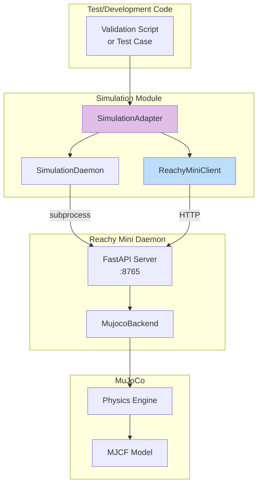
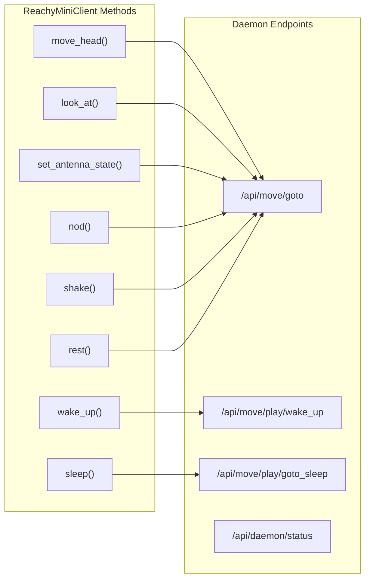

# Simulation Module API

The simulation module provides MuJoCo-based testing without physical hardware. It bridges the Reachy Agent MCP tools to the Reachy Mini daemon running in simulation mode.

## Architecture



## Quick Start

```python
from reachy_agent.simulation import create_simulation_adapter

async def main():
    # Create adapter with factory function
    adapter = create_simulation_adapter(
        scene="empty",      # or "minimal" for table with objects
        headless=True,      # No GUI window (for CI)
        port=8765,          # Daemon API port
    )

    # Use as async context manager
    async with adapter:
        client = adapter.client

        # Move head left
        result = await client.move_head("left", speed="fast")
        print(f"Move UUID: {result['uuid']}")

        # Nod twice
        result = await client.nod(times=2)
        print(f"Nod completed: {result['moves']} moves")

        # Set antenna positions
        await client.set_antenna_state(left_angle=90, right_angle=45)

# Run
import asyncio
asyncio.run(main())
```

## Module Components

### SimulationConfig

Configuration dataclass for the simulation daemon.

```python
from reachy_agent.simulation import SimulationConfig, SimulationScene

config = SimulationConfig(
    scene=SimulationScene.MINIMAL,  # Scene with table + objects
    headless=False,                  # Show MuJoCo viewer
    host="127.0.0.1",
    port=8000,
    startup_timeout=30.0,           # Seconds to wait for daemon
    health_check_interval=0.5,      # Polling interval
)
```

**Fields:**

| Field | Type | Default | Description |
|-------|------|---------|-------------|
| `scene` | `SimulationScene` | `EMPTY` | Simulation scene to load |
| `headless` | `bool` | `False` | Run without GUI window |
| `host` | `str` | `"127.0.0.1"` | Daemon bind address |
| `port` | `int` | `8000` | Daemon API port |
| `startup_timeout` | `float` | `30.0` | Max seconds to wait for startup |
| `health_check_interval` | `float` | `0.5` | Health check polling interval |

### SimulationScene

Available simulation scenes:

```python
from reachy_agent.simulation import SimulationScene

SimulationScene.EMPTY    # Robot only, no environment
SimulationScene.MINIMAL  # Robot + table with apple, croissant, duck
```

### SimulationDaemon

Manages the Reachy Mini daemon subprocess in simulation mode.

```python
from reachy_agent.simulation import SimulationDaemon, SimulationConfig

daemon = SimulationDaemon(config=SimulationConfig(headless=True))

# Manual lifecycle
await daemon.start()
try:
    print(f"Daemon URL: {daemon.base_url}")
    print(f"Running: {daemon.is_running}")
    health = await daemon.health_check()
    print(f"Health: {health}")
finally:
    await daemon.stop()

# Or use context manager
async with SimulationDaemon() as daemon:
    print(f"Ready at {daemon.base_url}")
```

**Properties:**

| Property | Type | Description |
|----------|------|-------------|
| `base_url` | `str` | HTTP endpoint (e.g., `http://127.0.0.1:8000`) |
| `is_running` | `bool` | Whether daemon process is alive |

**Methods:**

| Method | Returns | Description |
|--------|---------|-------------|
| `start()` | `None` | Launch daemon and wait for health |
| `stop()` | `None` | Gracefully terminate daemon |
| `restart()` | `None` | Stop then start |
| `health_check()` | `dict` | Query daemon status |

### SimulationAdapter

High-level adapter combining daemon lifecycle and client access.

```python
from reachy_agent.simulation import SimulationAdapter, SimulationConfig

adapter = SimulationAdapter(
    config=SimulationConfig(scene=SimulationScene.EMPTY)
)

async with adapter:
    # Access the HTTP client
    client = adapter.client

    # Check status
    health = await adapter.health_check()
    print(f"Simulation enabled: {health['simulation_enabled']}")
```

**Properties:**

| Property | Type | Description |
|----------|------|-------------|
| `client` | `ReachyMiniClient` | HTTP client for API calls |
| `is_running` | `bool` | Whether daemon is running |
| `base_url` | `str` | Daemon HTTP endpoint |

### ReachyMiniClient

HTTP client that maps high-level commands to Reachy Mini daemon API.



#### Movement Methods

**`move_head(direction, speed, degrees)`**

Move head in a cardinal direction.

```python
# Basic usage
await client.move_head("left")
await client.move_head("right", speed="fast")
await client.move_head("up", degrees=45)  # Custom angle

# Parameters
direction: str  # "left", "right", "up", "down", "front"
speed: str      # "slow" (2s), "normal" (1s), "fast" (0.5s)
degrees: float  # Override default 30° angle
```

**`look_at(roll, pitch, yaw, duration)`**

Precise head positioning with Euler angles.

```python
# Look slightly up and to the left
await client.look_at(roll=0, pitch=-15, yaw=20)

# Parameters (all in degrees)
roll: float     # Tilt left/right
pitch: float    # Up (negative) / Down (positive)
yaw: float      # Left (positive) / Right (negative)
duration: float # Movement duration in seconds
```

**`set_antenna_state(left_angle, right_angle, duration_ms)`**

Control antenna positions for expression.

```python
# Both antennas up
await client.set_antenna_state(left_angle=90, right_angle=90)

# Asymmetric (curious expression)
await client.set_antenna_state(left_angle=30, right_angle=60)

# Parameters
left_angle: float   # 0 (down) to 90 (up) degrees
right_angle: float  # 0 (down) to 90 (up) degrees
duration_ms: int    # Movement duration in milliseconds
```

#### Gesture Methods

**`nod(times, speed)`**

Perform nodding gesture (yes).

```python
await client.nod(times=2, speed="normal")

# Returns: {"status": "ok", "moves": 4}
```

**`shake(times, speed)`**

Perform head shake gesture (no).

```python
await client.shake(times=3, speed="fast")

# Returns: {"status": "ok", "moves": 6}
```

**`rest()`**

Return to neutral resting pose.

```python
await client.rest()
# Head centered, antennas at 45°, body yaw 0
```

#### Lifecycle Methods

**`wake_up()`**

Activate the robot (enable motors).

```python
result = await client.wake_up()
# Returns: {"uuid": "..."}
```

**`sleep()`**

Deactivate the robot (disable motors, safe position).

```python
result = await client.sleep()
# Returns: {"uuid": "..."}
```

#### Status Methods

**`get_status()`**

Get daemon status information.

```python
status = await client.get_status()
# {
#   "robot_name": "reachy_mini",
#   "state": "running",
#   "simulation_enabled": True,
#   "version": "1.2.3"
# }
```

**`get_full_state()`**

Get complete robot state.

```python
state = await client.get_full_state()
# {
#   "head_pose": {"x": 0, "y": 0, "z": 0, "roll": 0, "pitch": 0, "yaw": 0},
#   "antennas_position": [0.785, 0.785],  # radians
#   "body_yaw": 0
# }
```

### Factory Function

**`create_simulation_adapter(scene, headless, port)`**

Convenience function to create a configured adapter.

```python
from reachy_agent.simulation import create_simulation_adapter

# For development (with GUI)
adapter = create_simulation_adapter(scene="minimal", headless=False)

# For CI/testing
adapter = create_simulation_adapter(scene="empty", headless=True, port=8765)
```

## Daemon API Mapping

The client translates high-level commands to the Reachy Mini daemon's HTTP API:

| Client Method | HTTP Endpoint | Payload |
|--------------|---------------|---------|
| `move_head("left")` | `POST /api/move/goto` | `{"head_pose": {"yaw": 0.52}, "duration": 1.0}` |
| `look_at(pitch=-10)` | `POST /api/move/goto` | `{"head_pose": {"pitch": -0.17}, "duration": 1.0}` |
| `set_antenna_state(45, 45)` | `POST /api/move/goto` | `{"antennas": [0.78, 0.78], "duration": 0.5}` |
| `nod(times=2)` | Multiple `POST /api/move/goto` | Alternating pitch values |
| `wake_up()` | `POST /api/move/play/wake_up` | None |
| `sleep()` | `POST /api/move/play/goto_sleep` | None |
| `get_status()` | `GET /api/daemon/status` | None |

## Running the Validation Script

The validation script tests all simulation capabilities:

```bash
# Headless mode (for CI)
python scripts/validate_simulation.py --headless

# With GUI (requires mjpython on macOS)
mjpython scripts/validate_simulation.py

# Different scene
python scripts/validate_simulation.py --scene minimal --headless
```

**Output:**
```
============================================================
Reachy Agent MuJoCo Simulation Validation
============================================================

Configuration:
  Scene: empty
  Headless: True

[1/7] Starting simulation daemon...
  Daemon started successfully!

[2/7] Validating daemon health...
  PASSED

[3/7] Validating lifecycle controls...
  PASSED

[4/7] Validating head movement...
  move_head(left): OK - uuid=8464395e...
  move_head(right): OK - uuid=15b19951...
  PASSED

[5/7] Validating antenna control...
  PASSED

[6/7] Validating gestures...
  nod: OK - 4 moves
  shake: OK - 4 moves
  PASSED

[7/7] Validating precise positioning...
  PASSED

============================================================
VALIDATION RESULT: ALL TESTS PASSED
============================================================
```

## Testing

### Unit Tests (No Daemon Required)

```bash
# Run unit tests only
pytest tests/simulation/test_simulation_adapter.py -v -k "Unit"
```

### Integration Tests (Requires MuJoCo)

```bash
# Run all simulation tests (starts daemon automatically)
pytest tests/simulation/ -v

# Or with simulation marker
pytest -m simulation -v
```

### Test Coverage

```bash
pytest tests/simulation/ --cov=src/reachy_agent/simulation --cov-report=html
```

## Troubleshooting

### Daemon Won't Start

```
RuntimeError: Failed to start simulation daemon. Command not found: mjpython
```

**Solution:** Install MuJoCo support:
```bash
uv pip install "reachy-mini[mujoco]"
```

### Daemon Times Out

```
RuntimeError: Simulation daemon did not become healthy within 30.0s
```

**Solutions:**
1. Increase timeout: `SimulationConfig(startup_timeout=60.0)`
2. Check port availability: `lsof -i :8000`
3. Check daemon logs in stderr

### GUI Not Showing (macOS)

On macOS, MuJoCo requires `mjpython` for GUI rendering:

```bash
# Install mjpython
pip install mujoco

# Run with mjpython
mjpython scripts/validate_simulation.py
```

### Port Already in Use

```
OSError: [Errno 48] Address already in use
```

**Solution:** Use a different port:
```python
adapter = create_simulation_adapter(port=8766)
```

## Platform Notes

| Platform | GUI Support | Command |
|----------|-------------|---------|
| macOS | `mjpython` required | `mjpython -m reachy_mini.daemon.app.main --sim` |
| Linux | Native | `python -m reachy_mini.daemon.app.main --sim` |
| Windows | Native | `python -m reachy_mini.daemon.app.main --sim` |

All platforms support `--headless` for CI/testing.
