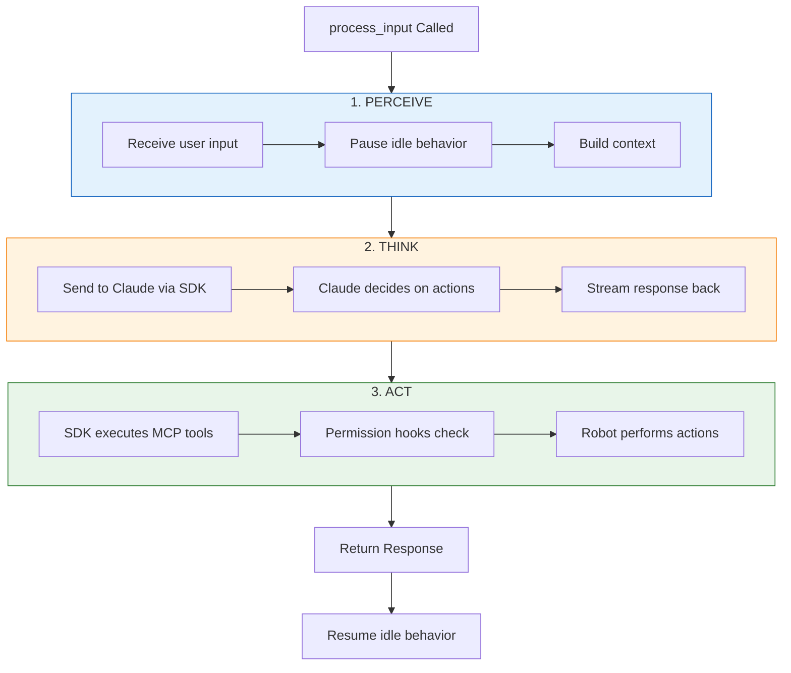
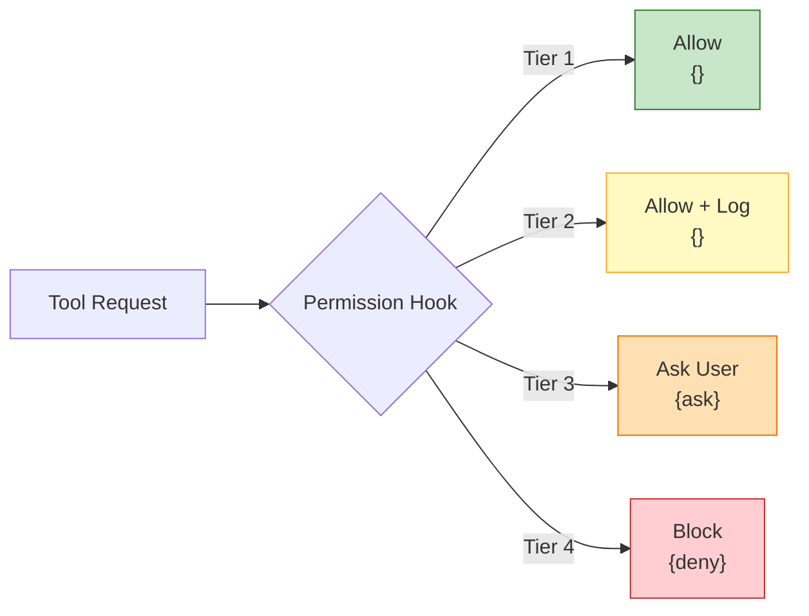
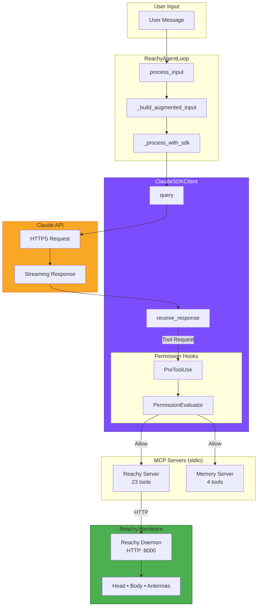

# ReachyAgentLoop Deep Dive

The `ReachyAgentLoop` is the brain of your Reachy robot. It implements the **Perceive → Think → Act** cycle - a common pattern in robotics AI. What makes this implementation special is how it uses the Claude Agent SDK to handle the "Think" phase, while integrating permission enforcement and memory for personalization.

## The Core Interaction Cycle



## Key Components

### 1. State Machine (AgentState)

The agent tracks its current state to prevent concurrent processing:

| State | Description |
|-------|-------------|
| `INITIALIZING` | Starting up, loading config |
| `READY` | Accepting input |
| `PROCESSING` | Handling a query |
| `ERROR` | Something went wrong |
| `SHUTDOWN` | Shutting down gracefully |

```python
class AgentState(str, Enum):
    INITIALIZING = "initializing"
    READY = "ready"
    PROCESSING = "processing"
    ERROR = "error"
    SHUTDOWN = "shutdown"
```

### 2. Initialization

The `__init__` method configures all major components:

| Component | Purpose |
|-----------|---------|
| `config` | Configuration from YAML files |
| `daemon_url` | Where to reach the robot hardware |
| `_client` | The Claude SDK client |
| `_permission_evaluator` | Checks if tools are allowed |
| `_idle_controller` | Makes robot look around when idle |
| `_memory_manager` | ChromaDB + SQLite for personalization |

### 3. MCP Server Configuration

MCP (Model Context Protocol) servers expose tools to Claude via a standard protocol. The SDK handles these as **subprocess stdio servers** - it spawns a Python process for each server and communicates over stdin/stdout.

```python
def _build_mcp_servers(self) -> dict[str, dict[str, Any]]:
    servers = {}

    # Reachy server for robot control (23 tools)
    servers["reachy"] = {
        "type": "stdio",
        "command": python_executable,
        "args": ["-m", "reachy_agent.mcp_servers.reachy", self.daemon_url],
    }

    # Memory server for personalization (4 tools)
    if self._enable_memory:
        servers["memory"] = {
            "type": "stdio",
            "command": python_executable,
            "args": ["-m", "reachy_agent.mcp_servers.memory"],
        }

    return servers
```

### 4. Permission Hooks

The **4-tier permission system** is enforced via SDK hooks. When Claude wants to use a tool, the SDK calls the permission hook **before** execution.



The hook returns one of:

| Return Value | Meaning | Tier |
|--------------|---------|------|
| `{}` | Allow execution | 1 (Autonomous), 2 (Notify) |
| `{"permissionDecision": "ask"}` | Prompt user | 3 (Confirm) |
| `{"permissionDecision": "deny"}` | Block execution | 4 (Forbidden) |

```python
async def _permission_hook(self, input_data, tool_use_id, context):
    tool_name = input_data.get("tool_name", "")

    # Strip SDK prefix: mcp__reachy__move_head → move_head
    if tool_name.startswith("mcp__"):
        parts = tool_name.split("__")
        original_tool = parts[2]

    # Evaluate permission tier
    decision = self._permission_evaluator.evaluate(original_tool)

    if decision.tier == PermissionTier.FORBIDDEN:
        return {"hookSpecificOutput": {"permissionDecision": "deny", ...}}

    if decision.needs_confirmation:
        return {"hookSpecificOutput": {"permissionDecision": "ask", ...}}

    return {}  # Allow
```

### 5. Main Processing Flow

The `process_input()` method is the main entry point:

```python
async def process_input(self, user_input: str, context=None):
    # 1. Check state
    if self.state != AgentState.READY:
        return AgentResponse(error="Agent not ready")

    # 2. Pause idle behavior (robot stops looking around)
    if self._idle_controller:
        await self._idle_controller.pause()

    # 3. Process with SDK
    augmented_input = self._build_augmented_input(user_input, context)
    response = await self._process_with_sdk(augmented_input, context)

    # 4. Resume idle behavior
    if self._idle_controller:
        await self._idle_controller.resume()

    return response
```

### 6. SDK Interaction

The SDK acts as a **streaming message processor**. When you call `client.query()`, Claude processes your input and may decide to call tools. The SDK automatically executes those tool calls via MCP, and streams results back.

| Message Type | Content | Purpose |
|--------------|---------|---------|
| `AssistantMessage` | `TextBlock` | Text response from Claude |
| `AssistantMessage` | `ToolUseBlock` | Claude is calling a tool |
| `AssistantMessage` | `ToolResultBlock` | Tool execution result |
| `ResultMessage` | Stats | Final cost and duration |

```python
async def _process_with_sdk(self, augmented_input, context):
    async with ClaudeSDKClient(options=self._build_sdk_options()) as client:
        await client.query(augmented_input)

        async for message in client.receive_response():
            if isinstance(message, AssistantMessage):
                for block in message.content:
                    if isinstance(block, TextBlock):
                        response_text += block.text
                    elif isinstance(block, ToolUseBlock):
                        tool_calls_made.append({...})

            elif isinstance(message, ResultMessage):
                cost_usd = message.total_cost_usd
```

### 7. Memory Integration

Memory provides **personalization** by storing user preferences and session history:

```python
async def _initialize_memory(self):
    self._memory_manager = MemoryManager(
        chroma_path=chroma_path,           # Vector store for semantic search
        sqlite_path=sqlite_path,            # Structured data (profiles)
        embedding_model="all-MiniLM-L6-v2", # Local embeddings
    )
    await self._memory_manager.initialize()

    # Load context for injection into system prompt
    self._user_profile = await self._memory_manager.get_profile()
    self._last_session = await self._memory_manager.get_last_session()

    # Start tracking this session
    await self._memory_manager.start_session()
```

The profile and last session get injected into the system prompt so Claude knows who it's talking to and what happened previously.

## Complete Architecture Flow



## Usage Examples

### Basic Usage

```python
from reachy_agent.agent import ReachyAgentLoop

async def main():
    agent = ReachyAgentLoop(
        daemon_url="http://localhost:8765",  # Simulation port
        enable_idle_behavior=True,
        enable_memory=True,
    )

    # Use context manager for automatic cleanup
    async with agent.session():
        response = await agent.process_input("Wave hello!")

        print(f"Response: {response.text}")
        print(f"Tools called: {response.tool_calls}")
        print(f"Cost: ${response.cost_usd:.4f}")
```

### With Custom Configuration

```python
from reachy_agent.agent import ReachyAgentLoop
from reachy_agent.behaviors.idle import IdleBehaviorConfig
from reachy_agent.utils.config import load_config

async def main():
    config = load_config("config/default.yaml")

    idle_config = IdleBehaviorConfig(
        look_around_interval=5.0,
        movement_range=0.3,
    )

    agent = ReachyAgentLoop(
        config=config,
        daemon_url="http://localhost:8000",
        enable_idle_behavior=True,
        idle_config=idle_config,
        enable_memory=True,
    )

    await agent.initialize()

    try:
        # Interactive loop
        while True:
            user_input = input("You: ")
            if user_input.lower() in ["quit", "exit"]:
                break

            response = await agent.process_input(user_input)
            print(f"Reachy: {response.text}")
    finally:
        await agent.shutdown()
```

### Programmatic Control

```python
async def demo_sequence():
    async with agent.session() as loop:
        # Wake up the robot
        await loop.process_input("Wake up and say hello!")

        # Pause idle behavior for precise control
        if loop.idle_controller:
            await loop.idle_controller.pause()

        # Execute a sequence
        await loop.process_input("Look left, then right, then nod")

        # Resume idle behavior
        if loop.idle_controller:
            await loop.idle_controller.resume()
```

## Key Takeaways

| Concept | Description |
|---------|-------------|
| **Perceive → Think → Act** | Classic robotics AI pattern with Claude handling "Think" |
| **MCP for tool access** | Robot control exposed as MCP tools, SDK handles transport |
| **Permission hooks** | 4-tier system enforced at SDK hook level |
| **Memory for context** | User profile and session history injected into prompts |
| **Idle behavior** | Robot looks around autonomously when not processing |
| **State machine** | Prevents concurrent processing, tracks lifecycle |

## Related Documentation

- [Architecture Overview](overview.md) - System-level architecture
- [MCP Tools Reference](../api/mcp-tools.md) - All 27 MCP tools
- [Permission System](../api/permissions.md) - 4-tier permission details
- [Memory API](../api/memory.md) - ChromaDB + SQLite integration

## Source Code

The implementation is in [`src/reachy_agent/agent/agent.py`](https://github.com/jawhnycooke/claude-in-the-shell/blob/main/src/reachy_agent/agent/agent.py).
