# Reachy Agent Architecture

This document describes the architecture of Reachy Agent, an embodied AI system that transforms the Reachy Mini desktop robot into an autonomous Claude-powered assistant.

## System Overview

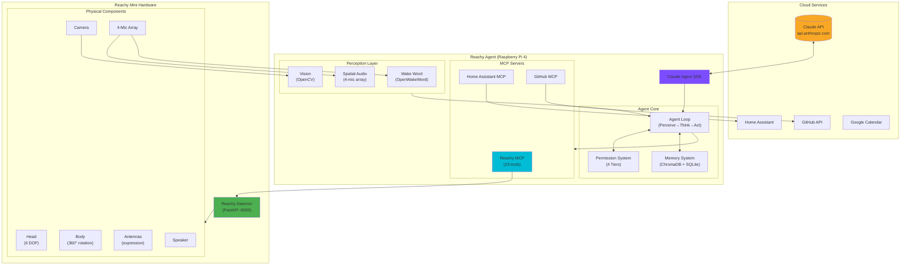

## Component Layers

### Layer 1: Cloud Intelligence

The system uses Claude API for natural language understanding and reasoning:

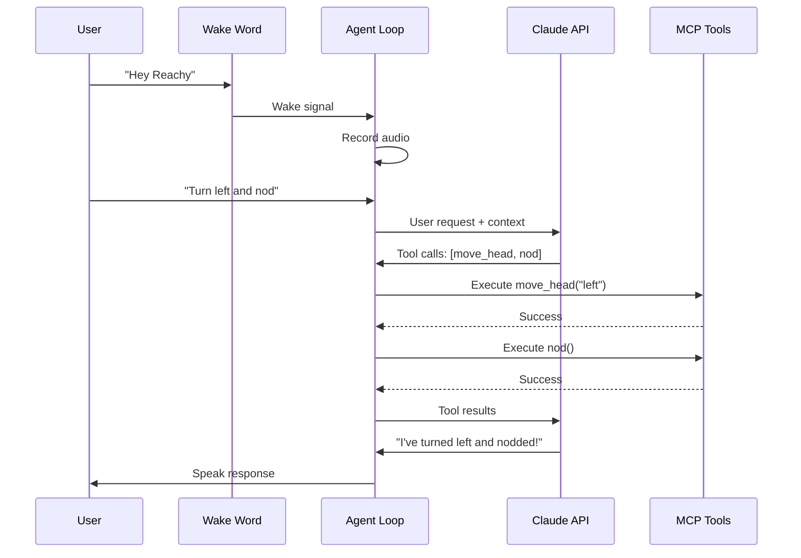

### Layer 2: Agent Core

The agent core manages the perception-action loop:

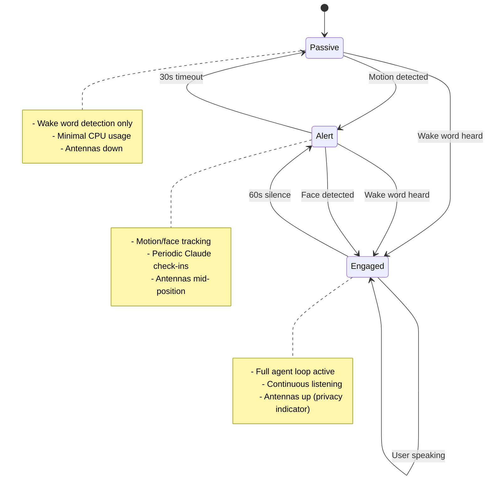

### Layer 3: MCP Protocol (True MCP Architecture)

MCP (Model Context Protocol) provides a standardized interface between Claude and tools.
**Key change:** The agent now uses **true MCP protocol** with subprocess communication:

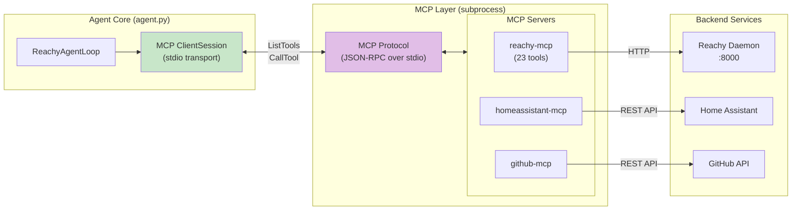

**MCP Protocol Flow:**
1. Agent spawns MCP server as subprocess (`python -m reachy_agent.mcp_servers.reachy`)
2. Agent discovers tools dynamically via `ListTools` (23 tools)
3. Agent executes tools via `CallTool` over stdio transport
4. MCP server calls Daemon HTTP API

### Layer 4: Permission System

Actions are classified into 4 permission tiers:

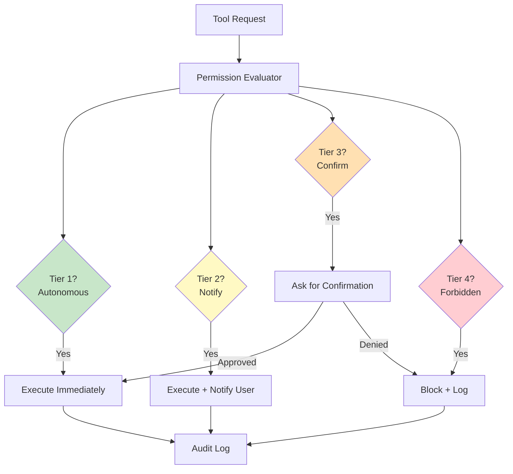

**Permission Tier Examples:**

| Tier | Category | Tools | Rationale |
|------|----------|-------|-----------|
| 1 | Autonomous | `move_head`, `play_emotion`, `capture_image` | Body control is safe, reversible |
| 2 | Notify | `homeassistant.*`, `send_notification` | User should know about actions |
| 3 | Confirm | `github.create_pr`, `calendar.create_event` | Irreversible external changes |
| 4 | Forbidden | `execute_code`, `delete_*`, `admin_*` | Security-critical operations |

### Layer 5: Hardware Interface

The Reachy Daemon provides a REST API to control hardware:

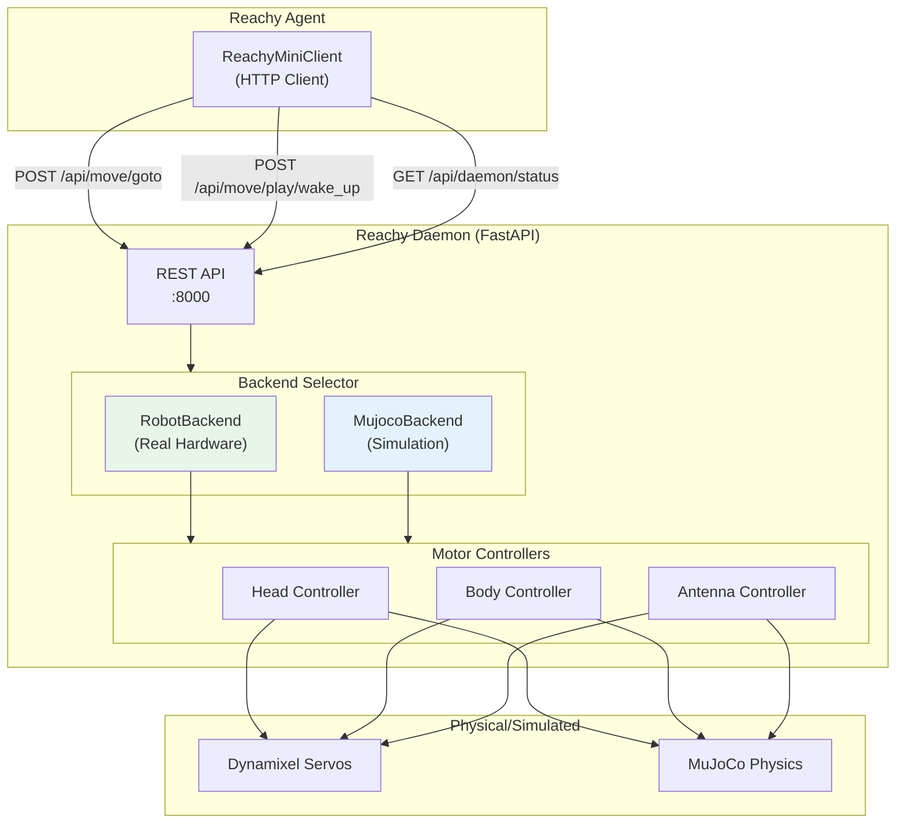

## Data Flow

### Request Lifecycle

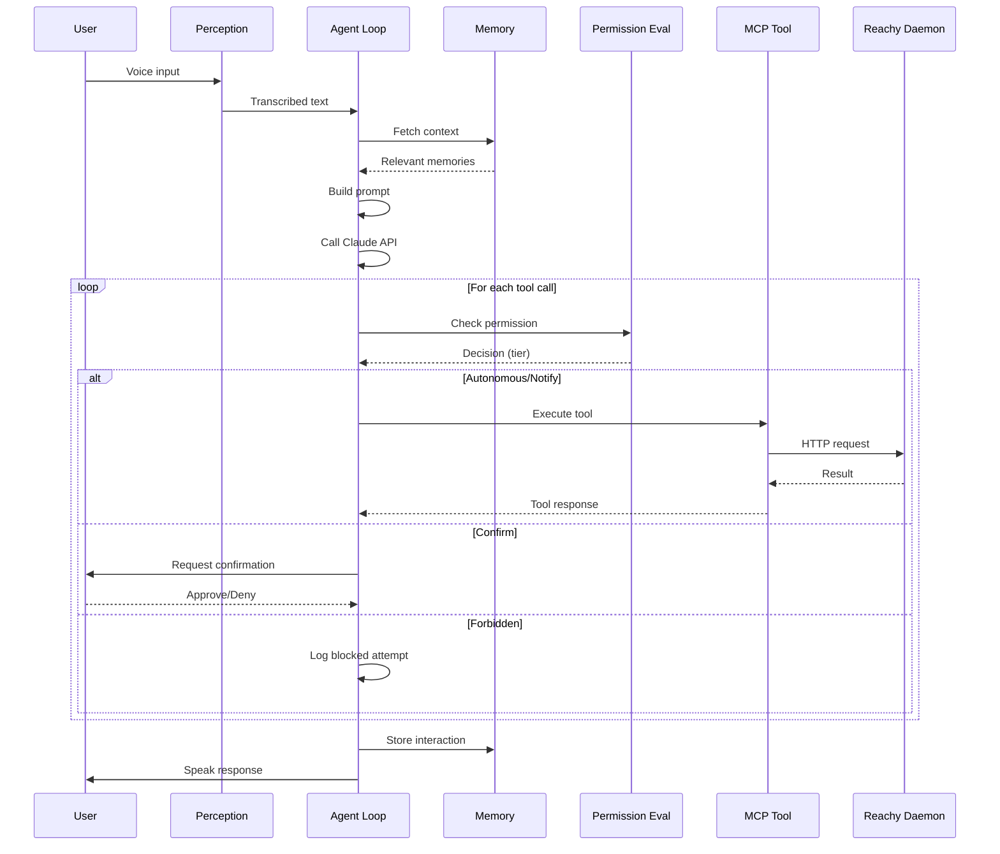

## Deployment Architecture

### Development (Simulation)

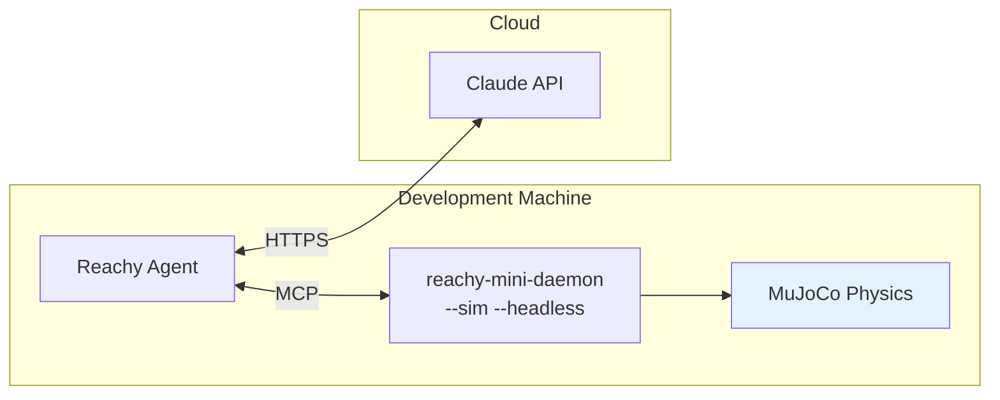

### Production (Hardware)

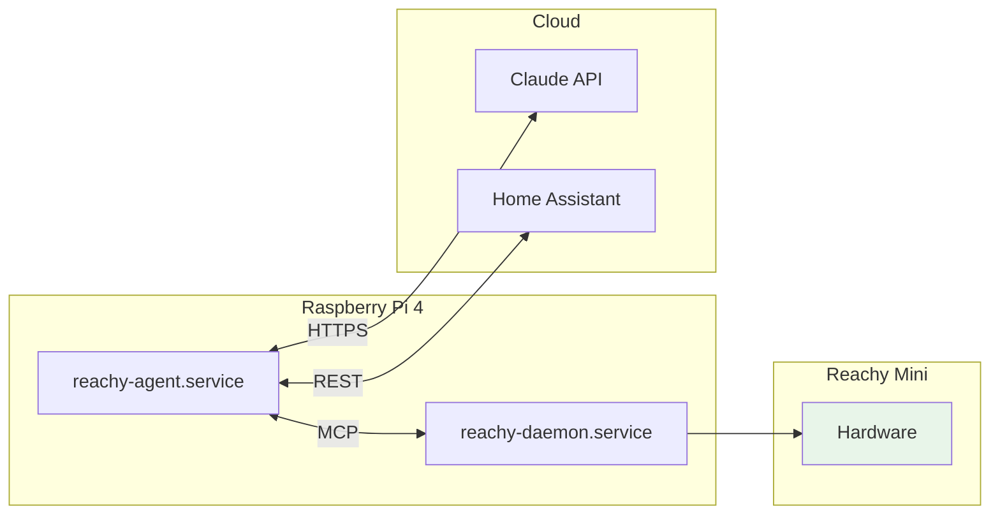

## Key Design Decisions

| Decision | Choice | Alternatives Considered | Rationale |
|----------|--------|------------------------|-----------|
| Process Model | Single asyncio | Multiple systemd services | Simpler debugging, lower memory |
| Wake Word | OpenWakeWord | Porcupine, Snowboy | Open source, no license costs |
| Memory Store | ChromaDB + SQLite | PostgreSQL, Redis | Lightweight, embedded, no server |
| Config Format | YAML | JSON, TOML | Human-readable, supports comments |
| MCP Transport | stdio subprocess | HTTP, direct calls | True MCP protocol, dynamic discovery |
| Tool Discovery | ListTools | Hardcoded schemas | Single source of truth, extensible |

## Security Model

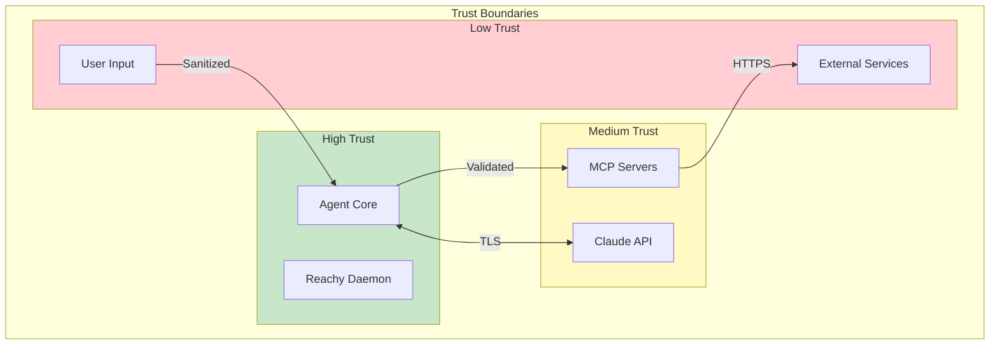

**Security Principles:**
1. **Least Privilege**: Each MCP server has minimal required permissions
2. **Defense in Depth**: Permission tiers + API validation + audit logging
3. **Fail Secure**: Unknown tools default to highest restriction tier
4. **Privacy by Design**: Antenna states indicate when agent is listening

## MCP Tools Overview

The Reachy MCP server provides 23 tools organized by category:

| Category | Tools | Mock Support |
|----------|-------|--------------|
| Movement (5) | `move_head`, `look_at`, `look_at_world`, `look_at_pixel`, `rotate` | 3/5 |
| Expression (6) | `play_emotion`, `play_recorded_move`, `set_antenna_state`, `nod`, `shake`, `rest` | 5/6 |
| Audio (2) | `speak`, `listen` | 2/2 |
| Perception (3) | `capture_image`, `get_sensor_data`, `look_at_sound` | 3/3 |
| Lifecycle (3) | `wake_up`, `sleep`, `rest` | 3/3 |
| Status (2) | `get_status`, `get_pose` | 2/2 |
| Control (2) | `set_motor_mode`, `cancel_action` | 1/2 |

### Native SDK Emotions

The agent uses native SDK emotions from `pollen-robotics/reachy-mini-emotions-library` (HuggingFace) when available:

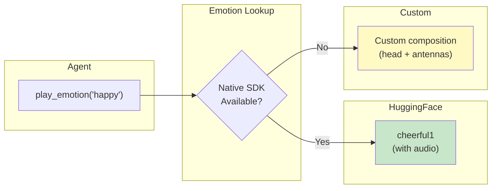

## Next Steps

See [Phase 2 Preparation Guide](../guides/phase2-preparation.md) for hardware integration details.
