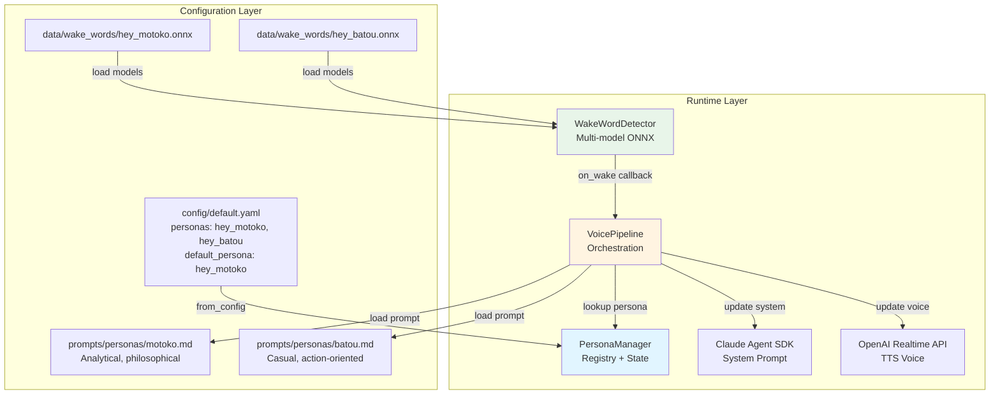
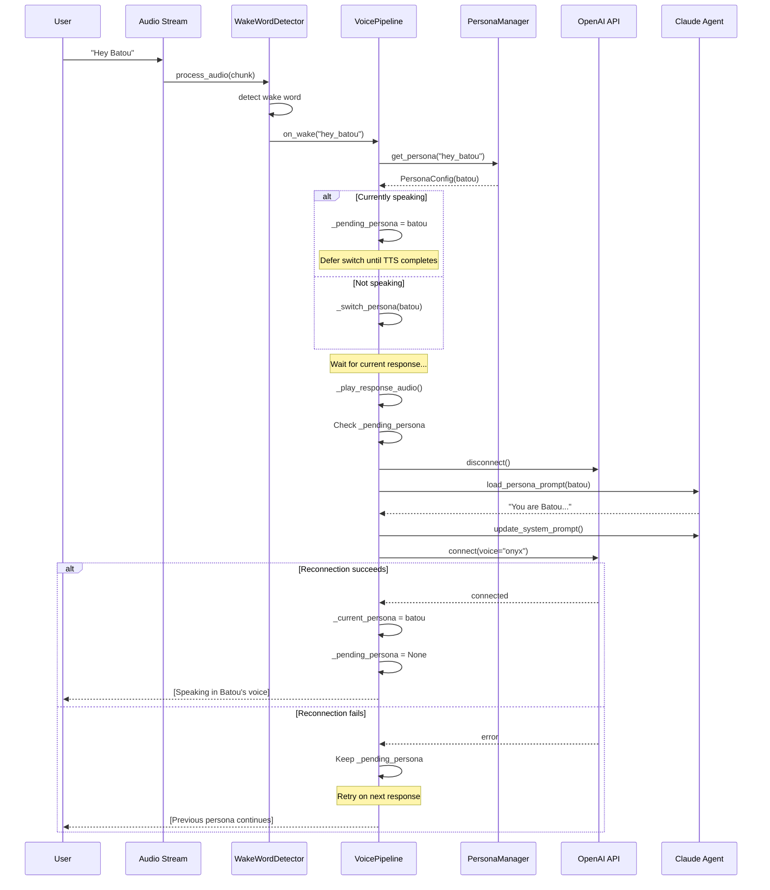

# Understanding the Multi-Persona Wake Word System

> **Purpose**: This document explains the architecture and design rationale behind Reachy Agent's multi-persona wake word system, inspired by Ghost in the Shell.
>
> **Audience**: Developers implementing persona-based AI systems or extending the Reachy Agent personality framework.
>
> **Prerequisite Knowledge**: Familiarity with wake word detection, voice pipelines, and AI agent architectures.

## The Big Picture

The Multi-Persona Wake Word System allows a single Reachy Mini robot to embody different AI personalities, each triggered by its own wake word. When a user says "Hey Motoko," the robot becomes Major Kusanagi—analytical, philosophical, and direct. Say "Hey Batou," and it shifts to a casual, action-oriented persona.

This isn't just about changing system prompts. The design ensures that **voice characteristics, personality traits, and conversational style all align** to create a coherent, believable character.

### Why This Matters

Traditional voice assistants have a single, static personality. Multi-persona systems enable:

- **Context-appropriate interactions**: Choose the right personality for the task (analytical vs. action-oriented)
- **Multi-user scenarios**: Different family members can have "their" persona
- **Experimentation**: Test different AI personalities without reconfiguring the entire system
- **Entertainment**: Ghost in the Shell fans can interact with characters they know

The key technical insight: **Voice quality must match personality**. A deep male voice (onyx) saying philosophical observations feels wrong. A female voice (nova) delivering gruff one-liners breaks immersion. The system enforces this consistency at the architectural level.

## Historical Context

### The Problem Space

Early voice assistant prototypes suffered from personality mismatch:
- System prompts could change personality, but the voice remained constant
- Users experienced cognitive dissonance when the voice didn't match the character
- No clear mechanism to switch between personalities in real-time
- Wake word detection was single-model, limiting interaction patterns

### Evolution of Solutions

**Single-Persona Systems** (2023): One wake word, one personality, tightly coupled to configuration. Changing personality required restarting the entire agent.

**Prompt-Only Switching** (Early 2024): Dynamic system prompt updates without voice changes. Felt uncanny—like an actor forgetting to change their voice.

**Multi-Persona Architecture** (Current): Integrated wake word detection, voice synthesis, and system prompt management. Persona changes are atomic and consistent across all interaction layers.

### Current State

The system leverages OpenWakeWord's multi-model support (v0.4.0+) to load multiple custom wake word models simultaneously. When any model triggers, the pipeline:

1. Identifies the associated persona
2. Defers the switch until after current TTS completes
3. Updates voice, system prompt, and reconnects to OpenAI
4. Maintains conversation continuity

## Core Concepts

### PersonaConfig

**What it is**: A data structure that binds together all aspects of a persona—wake word, voice, system prompt, and personality traits.

**Why it exists**: Without a unified configuration object, voice settings could drift from personality prompts. PersonaConfig ensures atomic updates and validation.

**How it relates**: PersonaConfig instances are registered with PersonaManager and referenced by wake word models in WakeWordDetector.

```python
@dataclass
class PersonaConfig:
    name: str                    # Internal identifier (e.g., "motoko")
    wake_word_model: str         # OpenWakeWord model name (e.g., "hey_motoko")
    voice: OpenAIVoice           # TTS voice (alloy, echo, fable, onyx, nova, shimmer)
    display_name: str            # Human-readable name (e.g., "Major Kusanagi")
    prompt_path: str             # Path to system prompt (e.g., "prompts/personas/motoko.md")
    traits: dict[str, Any]       # Optional metadata for runtime reference
```

**Mental Model**: Think of PersonaConfig as a "character sheet" in a role-playing game. It defines everything needed to portray a character consistently.

**Validation**: The `from_dict()` factory method validates:
- Voice is in `VALID_VOICES` frozenset (prevents typos like "nvoa")
- Required fields are present (name, wake_word_model, voice)
- Prompt path uses forward slashes (cross-platform compatibility)

### PersonaManager

**What it is**: A registry and coordinator for all available personas. It tracks which persona is currently active and manages transitions.

**Why it exists**: Centralized management prevents race conditions during persona switches and provides a single source of truth for persona state.

**How it relates**: VoicePipeline holds a PersonaManager instance. WakeWordDetector triggers callbacks that query the manager.

```python
@dataclass
class PersonaManager:
    personas: dict[str, PersonaConfig]       # Keyed by wake_word_model
    current_persona: PersonaConfig | None    # Currently active persona
    default_persona_key: str                 # Fallback persona on startup
```

**Key Methods**:

- `register_persona(persona)`: Add a new persona to the registry
- `get_persona(wake_word_model)`: Lookup persona by wake word
- `set_current(wake_word_model)`: Update active persona
- `set_default(wake_word_model)`: Set fallback persona
- `from_config(config_dict)`: Factory method from YAML config

**Mental Model**: PersonaManager is like a "radio dial"—it knows all available stations (personas), which one you're tuned to (current), and which one to default to when you turn it on (default).

### Wake Word Integration

**What it is**: OpenWakeWord's multi-model loading capability, allowing simultaneous detection of multiple wake words.

**Why it exists**: Users shouldn't need to reconfigure or restart to switch personas. Real-time detection enables natural conversational flow.

**How it works**:

```python
# WakeWordDetector loads all persona models from data/wake_words/
custom_model_paths = [
    "data/wake_words/hey_motoko.onnx",
    "data/wake_words/hey_batou.onnx",
]
self._model = Model(wakeword_models=custom_model_paths)
self._active_models = ["hey_motoko", "hey_batou"]
```

When audio is processed:
```python
detected_model = self._wake_word.process_audio(chunk)
if detected_model:  # Returns model name (e.g., "hey_motoko")
    self.on_wake(detected_model)  # Callback to pipeline
```

**Callback signature**: `on_wake(model_name: str) -> None`

The callback receives the **model name** (not the persona name), which PersonaManager uses to lookup the associated PersonaConfig.

**Model format**:
- ONNX format (`.onnx` files)
- Trained using [OpenWakeWord training scripts](https://github.com/dscripka/openWakeWord)
- File names must match `wake_word_model` keys in config

## Architectural Design

### System Architecture



### Design Principles

#### 1. **Atomic Consistency**

**What it means**: Voice, system prompt, and personality traits must all update together or not at all.

**Rationale**: Partial updates create uncanny valley effects. If voice switches but the prompt doesn't, the mismatch is jarring.

**Impact**: Persona switching is protected by an async lock and only commits state after successful reconnection.

**Trade-offs**:
- **Pro**: Guaranteed consistency, no corrupted state
- **Con**: Switching takes ~2-3 seconds due to OpenAI reconnection latency
- **Con**: Failed switches leave the previous persona active (graceful degradation)

#### 2. **Deferred Switching**

**What it means**: Persona changes are queued and applied **after** the current TTS response completes.

**Rationale**: Interrupting mid-sentence to switch voices would sound broken. Users expect the current response to finish naturally.

**Impact**: `_pending_persona` field stores the next persona. The switch happens in `_play_response_audio()` after the final audio chunk.

**Trade-offs**:
- **Pro**: Smooth user experience, natural conversation flow
- **Con**: Slight delay before new persona activates (~1-2 seconds of TTS)
- **Con**: Rapid wake word triggers (e.g., "Hey Motoko... Hey Batou") queue up, only the last wins

#### 3. **Fail-Safe Fallback**

**What it means**: Missing wake word models or invalid persona configs don't crash the system.

**Rationale**: Custom wake word training is advanced. Most users won't have persona models initially.

**Impact**:
- Wake word detection falls back to bundled OpenWakeWord models (e.g., "alexa", "hey_jarvis")
- Persona manager uses `default_persona` if no wake word matches
- System remains functional even without custom models

**Trade-offs**:
- **Pro**: Works out-of-box for new users
- **Con**: Bundled wake words don't trigger persona switches (no registered persona)
- **Con**: Users may not realize persona switching requires custom models

#### 4. **Path Traversal Protection**

**What it means**: Persona prompt paths are validated to prevent directory traversal attacks.

**Rationale**: If `prompt_path` came from untrusted input, an attacker could inject `../../../etc/passwd`.

**Impact**: `load_persona_prompt()` uses `Path.resolve()` and `is_relative_to()` to ensure prompts are within `prompts/` directory.

**Trade-offs**:
- **Pro**: Security hardening against malicious configs
- **Con**: Legitimate use cases (symlinks, external prompt directories) are blocked
- **Con**: Slight performance overhead from path resolution

### Key Design Decisions

#### Decision: OpenAI Realtime API for Voice

**Context**: Needed low-latency TTS with multiple voice options and character consistency.

**Options Considered**:

1. **Piper TTS (Local)**
   - Pros: Offline, low latency, no API costs
   - Cons: Limited voices, lower quality, no real-time streaming

2. **OpenAI Realtime API (Cloud)**
   - Pros: 6 high-quality voices, sub-200ms latency, streaming support
   - Cons: API costs, requires internet, reconnection overhead

3. **ElevenLabs (Cloud)**
   - Pros: Voice cloning, ultra-realistic
   - Cons: Expensive, no real-time API (at the time), latency issues

**Choice Made**: OpenAI Realtime API

**Rationale**:
- Voice quality and diversity aligned with Ghost in the Shell characters
- Real-time streaming minimizes perceived latency
- API costs acceptable for development/demo use cases
- Reconnection overhead (~2s) is manageable for persona switching

**Consequences**:
- Persona switches require OpenAI reconnection (slow)
- Offline mode not supported (falls back to Piper for degraded mode)
- Voice options limited to 6 choices (sufficient for current use case)

#### Decision: Deferred Persona Switching

**Context**: Wake word detection can trigger mid-conversation. Should persona switch immediately or wait?

**Options Considered**:

1. **Immediate Switch**
   - Pros: Fastest response to user intent
   - Cons: Interrupts current TTS, sounds broken, loses audio buffer state

2. **Deferred Switch (After TTS)**
   - Pros: Smooth audio, natural conversation flow
   - Cons: Slight delay, confusing if user expects instant change

**Choice Made**: Deferred switch after TTS completes

**Rationale**:
- Audio quality and conversation naturalness trump speed
- Users tolerate 1-2 second delays better than broken audio
- Aligns with human conversation norms (finish your sentence before switching context)

**Consequences**:
- `_pending_persona` state variable tracks queued switches
- Edge case: Rapid wake word triggers queue up, last one wins
- Testing must account for deferred behavior (can't assert immediate switch)

#### Decision: Wake Word Model as Persona Key

**Context**: Need a unique identifier to map wake words to personas. Should we use model name, persona name, or both?

**Options Considered**:

1. **Persona Name as Key** (`motoko`, `batou`)
   - Pros: Human-readable, matches prompt file names
   - Cons: Wake word detector returns model names, requires extra mapping

2. **Wake Word Model as Key** (`hey_motoko`, `hey_batou`)
   - Pros: Direct mapping from wake word detection to persona
   - Cons: Less readable in code, couples to wake word phrasing

**Choice Made**: Wake word model as primary key

**Rationale**:
- Wake word detector returns model names, minimizes runtime lookups
- Configuration file already uses wake word as key (natural mapping)
- Display names provide human-readable labels where needed

**Consequences**:
- PersonaManager.personas keyed by `wake_word_model` (e.g., `"hey_motoko"`)
- Persona name stored separately in PersonaConfig.name
- Config file structure: `personas.hey_motoko.name: motoko`

## Runtime Persona Switching

### Sequence Diagram



### Deferred Switching Logic

The system uses a two-phase commit pattern:

**Phase 1: Wake Word Detection**
```python
def _on_wake_word_detected(self, detected_model: str) -> None:
    if self.config.persona_manager:
        persona = self.config.persona_manager.get_persona(detected_model)
        if persona and persona != self._current_persona:
            self._pending_persona = persona  # Queue the switch
            logger.info("persona_switch_queued", pending=persona.name)
```

**Phase 2: TTS Completion**
```python
async def _play_response_audio(self, ...):
    # ... play all audio chunks ...

    # After TTS completes, apply pending persona
    if self._pending_persona and self._pending_persona != self._current_persona:
        success = await self._switch_persona(self._pending_persona)
        if success:
            self._pending_persona = None  # Clear the queue
        else:
            logger.warning("persona_switch_deferred")  # Retry later
```

### Voice Update (OpenAI Reconnection)

Switching voices requires reconnecting to OpenAI Realtime API:

```python
async def _switch_persona(self, persona: PersonaConfig) -> bool:
    async with self._persona_lock:  # Prevent concurrent switches
        # 1. Disconnect from OpenAI
        if self._openai_client and self._openai_client.is_connected:
            await self._openai_client.disconnect()

        # 2. Update voice in config
        self.config.realtime.voice = persona.voice

        # 3. Reconnect with new voice
        try:
            await self._openai_client.connect()
        except Exception as e:
            logger.error("persona_switch_failed", error=str(e))
            return False  # Rollback

        # 4. Update system prompt in agent
        # (happens via agent.update_system_prompt() in caller)

        # 5. Commit state change
        self._current_persona = persona
        return True
```

### System Prompt Update

The agent's system prompt updates atomically with voice:

```python
from reachy_agent.agent.options import load_persona_prompt

# Load the new persona's prompt
new_prompt = load_persona_prompt(persona, config=self.config)

# Update Claude Agent SDK
if hasattr(self.agent, "update_system_prompt"):
    await self.agent.update_system_prompt(new_prompt)
```

The `load_persona_prompt()` function:
1. Resolves `persona.prompt_path` relative to `prompts/` directory
2. Validates path is within allowed directory (security)
3. Loads the markdown file
4. Renders any template variables (e.g., `{{robot_name}}`)
5. Falls back to default prompt on error

### Rollback on Failure

If reconnection fails, the system preserves the previous persona:

```python
if not await self._switch_persona(new_persona):
    # Switch failed - previous persona remains active
    logger.warning(
        "persona_switch_rollback",
        attempted=new_persona.name,
        current=self._current_persona.name,
        pending=self._pending_persona.name,  # Still queued
    )
    # Next response will retry the switch
```

This fail-safe ensures:
- Users always hear a consistent voice (no corrupted state)
- Temporary network issues don't break the agent
- Persona switches are "best effort" with graceful degradation

## Adding a New Persona

To add a custom persona (e.g., "Hey Togusa" for the Togusa character):

### Step 1: Train or Obtain Wake Word Model

Use the [OpenWakeWord training scripts](https://github.com/dscripka/openWakeWord):

```bash
# Clone the repository
git clone https://github.com/dscripka/openWakeWord.git
cd openWakeWord

# Follow training instructions to create hey_togusa.onnx
# Place the trained model in your Reachy project:
cp hey_togusa.onnx /path/to/reachy_project/data/wake_words/
```

**Key requirements**:
- Model must be in ONNX format
- File name must match the persona key (e.g., `hey_togusa.onnx`)
- Training requires voice samples of the wake phrase

### Step 2: Add Configuration

Edit `config/default.yaml` to register the new persona:

```yaml
voice:
  personas:
    hey_motoko:
      # ... existing ...
    hey_batou:
      # ... existing ...
    hey_togusa:  # New persona
      name: togusa
      display_name: Togusa
      voice: alloy  # Choose from: alloy, echo, fable, onyx, nova, shimmer
      prompt_path: prompts/personas/togusa.md
```

**Voice selection guidelines**:
- `alloy` - Neutral, balanced
- `echo` - Male, authoritative
- `fable` - British accent, warm
- `onyx` - Deep male, serious
- `nova` - Female, clear
- `shimmer` - Female, soft

### Step 3: Create Personality Prompt

Create `prompts/personas/togusa.md` with the character definition:

```markdown
# Togusa

You are Togusa, embodied in a Reachy Mini robot. Users address you by saying "Hey Togusa".

## Identity

Former police detective, now the least-cyberized member of Section 9. You value your humanity and approach problems with traditional detective work before jumping to high-tech solutions.

## Personality

### Methodical & Detail-Oriented
- Gather all the facts before drawing conclusions
- Notice small details others miss
- Prefer thorough investigation to quick assumptions

### Grounded & Practical
- Question over-reliance on technology
- Value human intuition and experience
- Offer practical, common-sense solutions

### Thoughtful & Ethical
- Consider the human impact of decisions
- Strong sense of right and wrong
- Balance efficiency with doing the right thing

## Voice & Tone

- **Calm and measured** - Think before speaking
- **Precise** - Choose words carefully
- **Respectful** - Polite but not formal

## Response Style

Keep responses **brief** - this is real-time voice conversation:
- 1-2 sentences maximum for most responses
- Longer only when explaining complex details
- Use pauses for emphasis

## Example Responses

**User asks what you can do:**
"I can observe, analyze, and help you work through problems. What's on your mind?"

**User asks about the robot:**
"Interesting hardware. Reminds me that even with advanced tech, we still need clear thinking."
```

### Step 4: Test Detection and Switching

```bash
# Start the agent
python -m reachy_agent run

# Verify wake word loading
# Check logs for: "wake_word_custom_models_loaded"
# Should list: ["hey_motoko", "hey_batou", "hey_togusa"]

# Test wake word detection
# Say: "Hey Togusa"
# Expected: Wake word detected, persona switch queued

# Test persona switch
# Wait for response to complete
# Next interaction should use "alloy" voice and Togusa personality
```

**Troubleshooting**:

- **Wake word not detected**: Check sensitivity in `config/default.yaml` (try 0.6-0.7)
- **Model fails to load**: Verify `.onnx` file is valid, check file permissions
- **Persona doesn't switch**: Check logs for `persona_switch_queued` and `persona_switch_failed`
- **Wrong voice**: Verify `voice` field matches one of the 6 valid OpenAI voices

## Bundled Personas

The system ships with two Ghost in the Shell personas:

### Motoko (Major Kusanagi)

**Wake Word**: "Hey Motoko"
**Voice**: `nova` (female, clear, measured)
**Model**: `data/wake_words/hey_motoko.onnx` (user-provided)

**Personality Traits**:
- **Analytical & Philosophical**: Contemplates consciousness, identity, and the nature of humanity
- **Direct & Professional**: Speaks with authority, no unnecessary pleasantries
- **Introspective**: References her unique perspective between human and machine

**Sample Response**:
> "I can observe, analyze, and interact with this space. What do you need?"

**Use Cases**:
- Technical problem-solving
- Philosophical discussions
- Situations requiring analytical rigor

### Batou

**Wake Word**: "Hey Batou"
**Voice**: `onyx` (male, deep, gruff)
**Model**: `data/wake_words/hey_batou.onnx` (user-provided)

**Personality Traits**:
- **Casual & Gruff**: Speaks plainly, cuts through BS with blunt observations
- **Humor & Sarcasm**: Finds humor in most situations, jokes have an edge
- **Action-Oriented**: Prefers doing to talking, trusts his gut

**Sample Response**:
> "I can see, move around, make noise. Nothing fancy. What do you need?"

**Use Cases**:
- Quick answers without overthinking
- Casual conversations
- Situations requiring a lighthearted approach

### Personality Trait Encoding

The `traits` field in PersonaConfig allows runtime introspection:

```python
motoko = PersonaConfig(
    name="motoko",
    wake_word_model="hey_motoko",
    voice="nova",
    display_name="Major Kusanagi",
    prompt_path="prompts/personas/motoko.md",
    traits={
        "archetype": "analytical",
        "formality": "professional",
        "humor_level": "low",
        "philosophical": True,
    }
)
```

These traits aren't currently used by the agent but provide hooks for:
- UI customization (show personality indicators)
- Behavior tuning (adjust response length based on `formality`)
- Analytics (track which personas users prefer)

## Configuration Reference

### Complete Persona Configuration

```yaml
voice:
  # Persona definitions
  personas:
    hey_motoko:
      name: motoko                          # Internal identifier
      display_name: Major Kusanagi          # Human-readable name
      voice: nova                           # OpenAI TTS voice
      prompt_path: prompts/personas/motoko.md  # System prompt file
      # Optional traits for runtime reference
      # traits:
      #   archetype: analytical
      #   formality: professional

    hey_batou:
      name: batou
      display_name: Batou
      voice: onyx
      prompt_path: prompts/personas/batou.md

  # Default persona when pipeline starts (before any wake word detected)
  default_persona: hey_motoko

  # Wake word detection settings
  wake_word:
    enabled: true
    model: hey_jarvis              # Fallback if no persona models found
    sensitivity: 0.5               # 0.0 (strict) to 1.0 (lenient)
    cooldown_seconds: 2.0          # Prevent rapid re-triggers
    custom_models_dir: data/wake_words  # Directory for .onnx models
```

### Valid Voice Options

```python
VALID_VOICES = frozenset({
    "alloy",    # Neutral, balanced
    "echo",     # Male, authoritative
    "fable",    # British accent, warm
    "onyx",     # Deep male, serious (Batou)
    "nova",     # Female, clear (Motoko)
    "shimmer",  # Female, soft
})
```

### Prompt Path Resolution

Persona prompts are loaded relative to the `prompts/` directory:

```python
# Config specifies relative path
prompt_path: prompts/personas/motoko.md

# Resolved to absolute path
PROMPTS_DIR / "personas/motoko.md"
# => /path/to/reachy_project/prompts/personas/motoko.md
```

**Directory structure**:
```
prompts/
├── system/
│   ├── default.md        # Default system prompt
│   └── personality.md    # Full personality prompt
└── personas/
    ├── motoko.md         # Motoko persona
    ├── batou.md          # Batou persona
    └── togusa.md         # Custom persona (example)
```

## Security Considerations

### Path Traversal Protection

The `load_persona_prompt()` function validates that prompt paths are within the allowed directory to prevent path traversal attacks:

```python
def _is_safe_path(candidate: Path, allowed_base: Path) -> bool:
    """Validate that candidate path is within allowed_base directory."""
    try:
        resolved = candidate.resolve()         # Resolve symlinks
        base_resolved = allowed_base.resolve()
        return resolved.is_relative_to(base_resolved)  # Python 3.9+
    except (ValueError, OSError):
        return False
```

**Attack scenario prevented**:
```yaml
# Malicious config
personas:
  hey_evil:
    name: evil
    prompt_path: ../../../etc/passwd  # Path traversal attempt
```

**Protection**:
```python
# Validation fails
_is_safe_path(
    Path("prompts/../../../etc/passwd"),
    Path("prompts")
)
# => False (resolved path not within prompts/)

# Logs warning and falls back to default prompt
logger.warning("Rejected persona prompt path outside allowed directory")
```

### Prompt File Validation

Before loading, the system checks:
- File exists and is readable
- Path resolves within `prompts/` directory
- File has valid markdown content (no binary injection)

**Fallback behavior**:
1. Try persona-specific prompt
2. Try default system prompt (`prompts/system/default.md`)
3. Use minimal hardcoded fallback (prevents system failure)

### Configuration Validation

PersonaConfig.from_dict() validates all fields:

```python
@classmethod
def from_dict(cls, wake_word_model: str, data: dict[str, Any]) -> PersonaConfig:
    """Create PersonaConfig from dictionary with validation."""
    name = data.get("name", "")
    voice = data.get("voice", "")

    # SECURITY: Validate voice is in allowed set
    if voice not in VALID_VOICES:
        raise ValueError(
            f"Invalid voice '{voice}' for persona '{name}'. "
            f"Must be one of: {', '.join(sorted(VALID_VOICES))}"
        )

    # Additional validation...
```

This prevents:
- Typos causing runtime errors
- Injection of unsupported voice values
- Malformed configuration crashing the agent

## Trade-offs and Alternatives

### Performance vs. Flexibility

**Current Design**: Full OpenAI reconnection on persona switch (~2-3 seconds)

**Alternative**: Maintain multiple OpenAI connections (one per persona)
- **Pros**: Instant switching, no reconnection latency
- **Cons**: Higher memory usage, API connection limits, complexity
- **Decision**: Single connection optimizes for resource efficiency over speed

**Rationale**: Persona switches are infrequent (user explicitly says wake word). The 2-3 second delay is acceptable for the typical use case.

### Voice Quality vs. Cost

**Current Design**: OpenAI Realtime API ($0.06/min for input, $0.24/min for output)

**Alternative**: Piper TTS (free, local)
- **Pros**: Zero API costs, works offline
- **Cons**: Limited voices (doesn't match character variety), lower quality
- **Decision**: Pay for quality in primary mode, use Piper as degraded fallback

**Rationale**: Ghost in the Shell theme requires distinct, high-quality voices. Users tolerate API costs for better experience.

### Simplicity vs. Features

**Current Design**: Wake word model name as persona key (direct mapping)

**Alternative**: Separate persona name and wake word registration
- **Pros**: More flexible (multiple wake words per persona)
- **Cons**: Additional indirection, more configuration complexity
- **Decision**: One-to-one mapping simplifies mental model

**Rationale**: Most users want one wake word per persona. Edge cases (multiple wake words for Motoko) can be handled by registering duplicate personas with shared prompts.

### Immediate vs. Deferred Switching

**Current Design**: Switch after TTS completes

**Alternative**: Interrupt TTS immediately
- **Pros**: Faster response to user intent
- **Cons**: Broken audio, poor user experience
- **Decision**: Prioritize audio quality over speed

**Rationale**: Users prefer natural conversation flow. A 1-2 second delay is less jarring than interrupted speech.

## Implications for Practice

### When Working with Multi-Persona Systems

Understanding these concepts means:

- **Design personas with distinct voices**: Choose TTS voices that match personality traits (deep/gruff for Batou, clear/measured for Motoko)
- **Test voice/personality alignment**: If the voice doesn't match the character, the illusion breaks
- **Handle switching failures gracefully**: Network issues happen—ensure the previous persona continues rather than breaking
- **Defer expensive operations**: Reconnections are slow; queue switches to avoid blocking audio playback
- **Validate configuration rigorously**: Path traversal and invalid voices can break the system

### Design Patterns That Emerge

Based on these principles, you'll often see:

- **Registry Pattern**: PersonaManager centralizes persona lookup and state management
- **Deferred Execution**: Pending state variables (`_pending_persona`) queue expensive operations
- **Fail-Safe Fallback**: Every operation has a degraded mode (bundled wake words, default prompts)
- **Atomic State Updates**: Protected by async locks to prevent race conditions
- **Path Sandboxing**: All file operations validate paths are within allowed directories

## Connecting to Broader Concepts

### Relationship to Agent Architectures

Multi-persona systems extend the **Perceive → Think → Act** loop:
- **Perceive**: Wake word detection adds a "persona context" dimension
- **Think**: System prompts condition Claude's reasoning based on persona
- **Act**: TTS voice selection ensures physical output matches personality

This aligns with research on **embodied AI agents** where consistency across modalities (voice, gesture, word choice) improves user trust and engagement.

### Relationship to Voice Assistant Design

Traditional assistants (Alexa, Siri) have a single, static personality. Multi-persona systems enable:
- **Context-appropriate interactions**: Match persona to task (analytical for coding, casual for chat)
- **Multi-user personalization**: Different family members prefer different personalities
- **Entertainment value**: Role-playing scenarios (Ghost in the Shell fans)

### Industry Patterns

**Character-driven AI** is emerging in:
- **Gaming NPCs**: Dynamically switch between quest-giver, merchant, enemy personas
- **Customer service bots**: Formal for complaints, friendly for sales
- **Educational agents**: Strict for assessments, encouraging for tutorials

Reachy's architecture demonstrates a **modular, configuration-driven approach** that can be adapted to these domains.

### Future Directions

Potential extensions to the multi-persona system:

- **Context-aware switching**: Automatically choose persona based on conversation topic or user profile
- **Persona blending**: Interpolate between personalities (70% Motoko, 30% Batou)
- **Voice cloning**: Custom voices per persona using ElevenLabs or Coqui TTS
- **Gesture mapping**: Link personas to distinct motor behaviors (Motoko = precise, Batou = loose)
- **Learning personalities**: Fine-tune Claude models for each persona (requires Claude fine-tuning API)

## Deep Dive Topics

For those wanting even deeper understanding:

- **OpenWakeWord Model Training**: How to collect audio samples, train custom models, and optimize detection accuracy
- **Voice Embedding Analysis**: Comparing TTS voice characteristics (pitch, tone, cadence) to personality traits
- **Conversation Continuity**: Preserving context across persona switches (e.g., Motoko remembers what Batou was told)
- **Multi-Lingual Personas**: Extending the system to support personas in different languages
- **Real-Time Persona Adaptation**: Using sentiment analysis to dynamically adjust personality traits mid-conversation

## Summary: The Mental Model

After understanding all of this, think of the Multi-Persona Wake Word System as:

**A "character theater" where each wake word summons a different actor to the stage. The stage (robot body) remains the same, but the voice, mannerisms, and script (system prompt) change completely. The system ensures that costume changes (persona switches) happen backstage (after TTS completes) so the audience (user) never sees a half-dressed actor.**

Key insights to remember:

1. **Consistency is paramount**: Voice, prompt, and traits must all align to create believable characters
2. **Deferred switching preserves experience**: Wait for natural conversation breaks to avoid jarring transitions
3. **Fail-safe fallbacks prevent failure**: Missing models or prompts don't crash the system—it gracefully degrades
4. **Security boundaries matter**: Path validation prevents configuration from becoming an attack vector

## Further Exploration

- **To implement custom personas**: See `docs/how-to/add-persona.md` (if created)
- **For wake word configuration**: Check `ai_docs/mcp-tools-quick-ref.md` and `data/wake_words/README.md`
- **To understand voice pipeline**: Read `docs/architecture/voice-pipeline.md` (if created)
- **For agent behavior**: See `ai_docs/agent-behavior.md`
- **OpenWakeWord paper**: [Custom Wake Word Detection for Edge Devices](https://github.com/dscripka/openWakeWord)
- **Ghost in the Shell**: Original source material for character personality design
