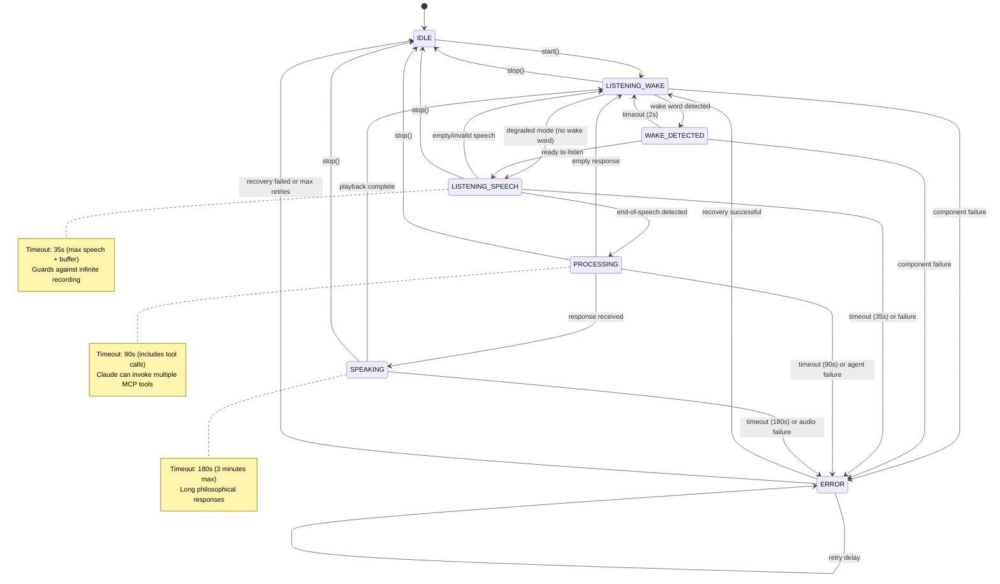
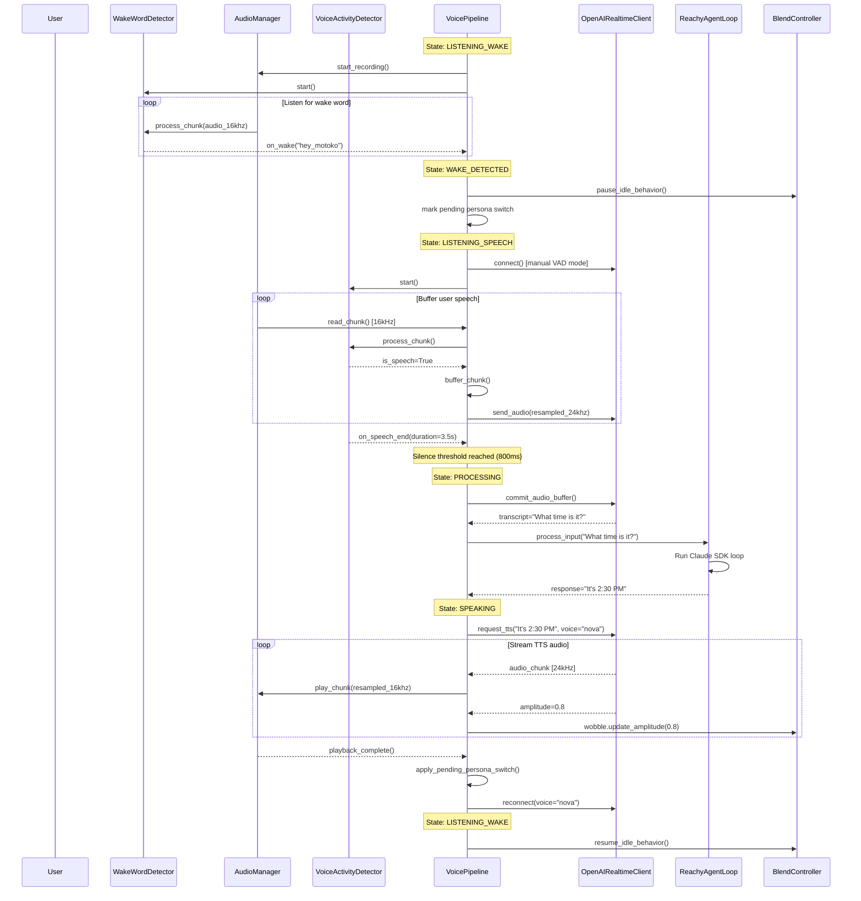

# Understanding the Voice Pipeline Architecture

> **Purpose**: This document explains the architectural design and component interactions of Reachy's voice interaction system
> **Audience**: Developers working on voice features, integration engineers, and system architects
> **Prerequisite Knowledge**: Familiarity with async Python, state machines, audio processing concepts

## The Big Picture

The Voice Pipeline transforms Reachy from a manually-controlled robot into an autonomous conversational agent. It orchestrates a complex real-time dataflow from wake word detection through speech recognition, AI processing, and synthesized speech output—all while maintaining tight integration with Reachy's physical embodiment through synchronized head movements and idle behaviors.

### Why This Matters

Voice interaction is the primary interface for autonomous operation. Unlike traditional chatbots that process discrete text messages, the Voice Pipeline must:

- **Maintain conversational context** across multiple turns
- **Coordinate with physical embodiment** (head wobble during speech, idle behaviors)
- **Handle real-time constraints** (low latency, no dropped audio frames)
- **Degrade gracefully** when components fail (network outages, hardware issues)
- **Support multiple personas** with distinct voices and personalities

The architecture's resilience and state management directly determine whether Reachy feels responsive and natural, or sluggish and robotic.

## Historical Context

### The Problem Space

Desktop robots face unique challenges for voice interaction:

1. **Limited computational resources** - Raspberry Pi 4 cannot run full STT/TTS models locally
2. **Shared audio hardware** - Daemon (motion SDK) and voice pipeline both need microphone/speaker access
3. **Network dependency** - Cloud APIs introduce latency and failure modes
4. **Physical embodiment constraints** - Voice must synchronize with motor control (wobble, breathing)
5. **Wake word false positives** - Room noise, TV audio, Reachy's own voice can trigger detection

### Evolution of Solutions

**First Generation (HTTP Polling)**:
- Simple HTTP requests to OpenAI API
- No wake word detection (always listening or manual trigger)
- Blocking I/O caused motion freezes
- No error recovery or degraded modes

**Second Generation (Event-Driven)**:
- Added OpenWakeWord for wake word detection
- Async I/O separated from motion control
- Basic retry logic for API failures
- Still brittle—single component failure stopped entire pipeline

**Current Architecture (State Machine + Recovery)**:
- Explicit state machine with validated transitions
- Timeout guards prevent stuck states
- Multi-level recovery strategies (retry → degrade → abort)
- OpenAI Realtime API for streaming STT/TTS
- Persona system for multi-personality support
- HeadWobble synchronized with TTS audio amplitude

### Current State

The Voice Pipeline is production-ready with comprehensive error handling, but still evolving:

- **Stable**: State machine, audio management, wake word detection
- **Maturing**: OpenAI Realtime integration (manual VAD mode), persona switching
- **Experimental**: Multi-persona wake words (Ghost in the Shell theme), local TTS fallback

## Core Concepts

### State Machine as the Central Coordinator

**What it is**: A finite state machine (FSM) that models the voice interaction lifecycle as discrete states with validated transitions.

**Why it exists**: Real-time audio processing involves complex asynchronous operations (WebSocket connections, audio buffering, motor control). Without explicit state management, race conditions and deadlocks are inevitable. The FSM provides:
- **Predictability**: Only valid transitions are allowed (e.g., cannot jump from WAKE_DETECTED to SPEAKING)
- **Debuggability**: Every state transition is logged with timestamps
- **Timeout safety**: States that should be transient (PROCESSING) have timeout guards

**How it relates**: The state machine is the "brain" that coordinates all other components (AudioManager, WakeWordDetector, OpenAI client, Agent).



**Mental Model**: Think of the state machine like a traffic light controller—it enforces safe transitions between states, prevents illegal moves (e.g., going from red directly to green without yellow), and has fallback logic (flashing red) when sensors fail.

### Manual VAD Mode with OpenAI Realtime

**What it is**: A configuration where the local Silero VAD (Voice Activity Detector) determines end-of-speech, then commits the buffered audio to OpenAI Realtime for transcription.

**Why it exists**: OpenAI Realtime has two modes:
1. **Server VAD** - Server decides when speech ends (lower latency, less control)
2. **Manual VAD** - Client controls speech segmentation (more control, requires local VAD)

We use manual VAD because:
- **Persona switching requires local control** - We need to know which wake word was detected before sending to OpenAI
- **Multi-turn conversations need explicit boundaries** - Server VAD can merge separate questions
- **Silero VAD works offline** - Provides fallback when network is flaky

**How it relates**: The VoicePipeline buffers audio chunks during LISTENING_SPEECH state. When VAD detects end-of-speech, the pipeline commits the entire buffer to OpenAI via `commit_audio_buffer()`.

```python
# Key interface in openai_realtime.py
async def commit_audio_buffer(self) -> tuple[str, list[bytes]]:
    """Finalize audio input and wait for transcription + TTS.

    Returns:
        (transcript, audio_chunks) - The recognized text and TTS audio
    """
```

**Trade-offs**:
- **Pro**: Full control over conversation turn boundaries
- **Pro**: Can switch voices/personas mid-conversation
- **Con**: Additional latency (local VAD processing + network roundtrip)
- **Con**: More complex state management (buffering, committing, clearing)

### Audio Stream Resampling (16kHz ↔ 24kHz)

**What it is**: Real-time conversion between Reachy's microphone sample rate (16kHz) and OpenAI Realtime's expected rate (24kHz), and vice versa for speaker output.

**Why it exists**:
- **Silero VAD requires 16kHz** - The model is trained on 16kHz audio with 512-sample chunks
- **OpenAI Realtime uses 24kHz** - Higher quality for STT/TTS
- **Reachy's hardware native rate is 16kHz** - Less CPU overhead on Pi

**How it relates**: The `AudioManager` performs resampling transparently:

```python
# AudioManager interface
async def read_chunk(self) -> bytes:
    """Read one 512-sample chunk at 16kHz (for VAD)."""

async def send_audio_to_openai(self, chunk_16khz: bytes) -> bytes:
    """Resample 16kHz → 24kHz for OpenAI."""
```

**Mental Model**: Think of it like video format conversion—the content is the same, but the resolution changes to match each component's requirements.

### ALSA Shared Device Architecture

**What it is**: ALSA (Advanced Linux Sound Architecture) virtual devices that allow multiple processes to access the same hardware concurrently.

**Why it exists**: Both the Reachy daemon (for SDK `play_audio()` calls) and the Voice Pipeline need microphone/speaker access simultaneously. Linux audio devices are typically exclusive-access.

**Solution**:
- **dsnoop** (device 4) - Shared input from 4-mic array
- **dmix** (device 3) - Mixed output to speaker

```yaml
# config/default.yaml
audio:
  input_device_index: 4   # reachymini_audio_src (dsnoop)
  output_device_index: 3  # reachymini_audio_sink (dmix)
```

**Trade-offs**:
- **Pro**: No resource conflicts between daemon and voice pipeline
- **Con**: Slight latency increase (dmix buffering)
- **Con**: Platform-specific configuration (ALSA on Raspberry Pi OS)

### Persona System with Deferred Switching

**What it is**: Multiple AI personalities (e.g., "Motoko", "Batou") with distinct wake words, voices, and system prompts. Persona switches are deferred until after TTS playback completes.

**Why it exists**:
- **Ghost in the Shell theme** - Each persona has unique characteristics (analytical vs. action-oriented)
- **Context preservation** - Switching mid-conversation would lose conversational context
- **Voice consistency** - TTS audio must match the persona who started speaking

**How it works**:

1. User says "Hey Motoko" → Wake word detector identifies model `hey_motoko`
2. Pipeline marks `_pending_persona_switch = PersonaConfig("motoko", voice="nova", ...)`
3. Current response completes with current persona's voice
4. After TTS playback, pipeline applies switch and updates OpenAI voice

```python
# Deferred switching in pipeline.py
async def _play_response(self) -> None:
    """Play TTS response, then apply pending persona switch."""
    # ... play audio ...

    # Apply deferred persona switch after response completes
    if self._pending_persona_switch:
        await self._apply_persona_switch(self._pending_persona_switch)
        self._pending_persona_switch = None
```

**Trade-offs**:
- **Pro**: No mid-conversation voice changes (jarring UX)
- **Pro**: Maintains conversational coherence
- **Con**: One-turn delay before new persona activates
- **Con**: User must wait for current response to finish

## Architectural Design

### Design Principles

1. **Fail Gracefully, Never Crash**
   - Rationale: Robot interaction should feel natural—network glitches shouldn't cause abrupt silence
   - Impact: Extensive error handling in every async operation, recovery strategies at multiple levels
   - Trade-offs: More complex code, additional testing burden for degraded modes

2. **State is Explicit, Transitions are Validated**
   - Rationale: Async audio processing creates race conditions; explicit FSM prevents impossible states
   - Impact: Every state change goes through `_set_state()` with transition validation
   - Trade-offs: Less flexibility (cannot bypass state machine), more verbose logging

3. **Local Components are Fallbacks, Not Replacements**
   - Rationale: Cloud APIs provide better quality, but we need offline capability for demos/development
   - Impact: OpenWakeWord models can fall back to bundled models, Silero VAD falls back to energy-based detection
   - Trade-offs: Larger binary size (bundled models), more configuration options

4. **Physical Embodiment is First-Class**
   - Rationale: Voice without synchronized motion feels disconnected and robotic
   - Impact: HeadWobble receives real-time audio amplitude, idle behaviors pause during conversation
   - Trade-offs: Motion control failures can block voice pipeline (mitigated by error handling)

### Key Design Decisions

#### Decision: Use OpenAI Realtime with Manual VAD (not Server VAD)

**Context**: OpenAI Realtime API offers two modes for detecting end-of-speech:
1. **Server VAD** - OpenAI decides when user finished speaking (simpler, lower latency)
2. **Manual VAD** - Client sends explicit "commit" signal (more control, requires local VAD)

**Options Considered**:

1. **Server VAD Mode**
   - Pros: Simpler implementation, lower latency (one less processing step), no local VAD needed
   - Cons: Cannot switch personas mid-session (voice is session-scoped), less control over turn boundaries, potential for merging separate questions

2. **Manual VAD Mode** (chosen)
   - Pros: Full control over when audio is committed, can switch OpenAI voice between turns, explicit conversation boundaries
   - Cons: Requires local Silero VAD (CPU overhead on Pi), additional latency (VAD processing + buffer commit), more complex state management

**Choice Made**: Manual VAD mode

**Rationale**:
- Persona switching is a core feature—requires ability to change OpenAI voice parameter between turns
- Explicit turn boundaries improve conversational quality (server VAD sometimes merges "What time is it? Also, move your head left" into one turn)
- Silero VAD provides offline capability for development/demos without network

**Consequences**:
- Voice Pipeline must maintain audio buffer during LISTENING_SPEECH state
- End-of-speech detection is client-side responsibility (more error modes)
- Switching personas mid-conversation requires WebSocket reconnection with new session config

---

#### Decision: State Machine with Timeout Guards (not Event-Driven Callbacks)

**Context**: Real-time voice processing involves many asynchronous operations that can hang (network timeouts, hardware failures). We needed a mechanism to prevent the pipeline from getting stuck.

**Options Considered**:

1. **Pure Async/Await with Try/Except**
   - Pros: Simple, idiomatic Python, minimal abstraction
   - Cons: No global view of pipeline state, hard to detect "stuck" conditions (e.g., waiting for speech that never ends)

2. **Event-Driven Callbacks** (Actor Model)
   - Pros: Decoupled components, easy to add new event handlers
   - Cons: Harder to reason about state, callback hell, difficult to enforce valid transitions

3. **Explicit State Machine with Timeout Guards** (chosen)
   - Pros: Clear state at any moment, enforced valid transitions, automatic timeout recovery
   - Cons: More boilerplate (state transition validation), harder to add new states, verbose logging

**Choice Made**: State machine with timeout guards

**Rationale**:
- **Debuggability**: When users report "Reachy stopped listening", logs show exactly which state timed out
- **Safety**: Timeout guards prevent infinite waits (e.g., LISTENING_SPEECH has 35s timeout)
- **Testability**: Can unit test each state transition independently

**Consequences**:
- Every new state requires timeout configuration in `STATE_TIMEOUTS`
- State transition matrix must be updated when adding states (`VALID_TRANSITIONS`)
- More complex code structure (state transition validation, timeout task management)

---

#### Decision: Deferred Persona Switching (not Immediate)

**Context**: Wake word detection happens at the start of a conversation turn, but OpenAI Realtime sessions are voice-scoped. Switching voices mid-session requires WebSocket reconnection.

**Options Considered**:

1. **Immediate Switching on Wake Word**
   - Pros: User sees instant feedback (Reachy "becomes" the new persona)
   - Cons: Interrupts current TTS playback (jarring), loses WebSocket connection mid-response, complex reconnection logic

2. **One Session Per Turn** (create new session for each question)
   - Pros: Clean separation, easy to switch voices
   - Cons: Significant latency overhead (WebSocket handshake every turn), loses conversational context

3. **Deferred Switching After TTS Completes** (chosen)
   - Pros: Smooth UX (no interruptions), maintains conversational flow, simple implementation
   - Cons: One-turn delay before persona activates, user must wait for current response to finish

**Choice Made**: Deferred switching after TTS playback

**Rationale**:
- **User experience**: Interrupting mid-sentence is jarring and feels buggy
- **Technical simplicity**: Switching between turns avoids complex WebSocket state management
- **Conversational coherence**: Current question gets answered in the voice that started the conversation

**Consequences**:
- Pipeline tracks `_pending_persona_switch` state variable
- Wake word detection must map model name → PersonaConfig
- Persona switches require WebSocket reconnection (brief pause before next turn)

---

#### Decision: ALSA Shared Devices (not Exclusive Access)

**Context**: Reachy daemon and Voice Pipeline both need audio hardware access. Standard ALSA devices are exclusive-access (one process locks the device).

**Options Considered**:

1. **PulseAudio Server**
   - Pros: Industry standard, automatic mixing, per-app volume control
   - Cons: Additional daemon overhead on Pi 4, configuration complexity, another failure point

2. **Exclusive Access with Mutex**
   - Pros: Simple, no shared device configuration
   - Cons: Daemon and voice pipeline cannot run simultaneously (breaks autonomous mode)

3. **ALSA dsnoop/dmix Virtual Devices** (chosen)
   - Pros: Lightweight (kernel-level), no additional daemons, works with PyAudio
   - Cons: ALSA-specific (not portable to macOS), requires manual device index configuration

**Choice Made**: ALSA dsnoop (input) / dmix (output)

**Rationale**:
- **Raspberry Pi OS is the target platform** - ALSA portability not critical
- **Minimal overhead** - No PulseAudio daemon competing for CPU
- **Proven solution** - Reachy daemon already uses dmix for SDK audio

**Consequences**:
- Device indices are hardcoded in config (device 4 = dsnoop, device 3 = dmix)
- Development on macOS requires mock daemon or different device indices
- ALSA configuration must be validated during setup (see `scripts/setup_audio.sh`)

## Data Flow

The following sequence diagram illustrates a complete conversation turn, from wake word detection through TTS playback:



### Key Dataflow Insights

1. **Audio Resampling Happens at Pipeline Boundaries**
   - Microphone → VAD: 16kHz (Silero's native rate)
   - Pipeline → OpenAI: 24kHz (upsampled via `resample_to_24khz()`)
   - OpenAI → Speaker: 24kHz → 16kHz (downsampled)

2. **Buffering Strategy**
   - During LISTENING_SPEECH: Audio chunks buffered in `_audio_buffer`
   - On end-of-speech: Entire buffer committed to OpenAI with `commit_audio_buffer()`
   - After commit: Buffer cleared, ready for next turn

3. **Amplitude-Driven Motion**
   - OpenAI Realtime emits audio amplitude with each TTS chunk
   - Pipeline forwards to `HeadWobble.update_amplitude()`
   - HeadWobble modulates head pitch/yaw based on amplitude (appears to "speak")

4. **Persona Switching Sequence**
   - Wake word detected → Mark pending switch (don't apply yet)
   - Current response completes → Apply switch
   - Reconnect WebSocket with new voice parameter
   - Next turn uses new persona

## Integration Points

### Agent Integration: `process_input()` for Claude Responses

The Voice Pipeline delegates all conversational AI to the `ReachyAgentLoop` via the `process_input()` method:

```python
# In pipeline.py (PROCESSING state)
async def _process_speech(self) -> None:
    """Process transcribed speech through Claude agent."""

    if self.agent:
        response_text = await self.agent.process_input(
            self._current_transcript,
            context=AgentContext(modality="voice")
        )
    else:
        # Fallback: Echo the transcript
        response_text = f"I heard you say: {self._current_transcript}"
```

**Why this design**:
- **Separation of concerns**: Voice Pipeline handles audio I/O, Agent handles reasoning
- **Consistent interface**: Text-based chat and voice both use `process_input()`
- **Context propagation**: Agent can adjust behavior based on `modality="voice"` (e.g., shorter responses)

**Data exchange**:
- **Input**: `(transcript: str, context: AgentContext)` - Recognized speech + metadata
- **Output**: `response_text: str` - Agent's response (may include tool call results)

**Error handling**:
- Agent errors (e.g., Claude API timeout) raise exceptions caught by Pipeline
- Pipeline transitions to ERROR state and applies recovery strategy
- If agent is unavailable (offline mode), fallback to echo or canned responses

---

### Motion Integration: HeadWobble During TTS

The HeadWobble behavior synchronizes head motion with TTS audio amplitude, creating the illusion of speech:

```python
# In pipeline.py (SPEAKING state)
def _on_audio_amplitude(self, amplitude: float) -> None:
    """Callback for TTS audio amplitude (for HeadWobble)."""
    if self.on_audio_amplitude:
        self.on_audio_amplitude(amplitude)

    # Also update agent's wobble if available
    if self.agent and hasattr(self.agent, "_wobble"):
        self.agent._wobble.update_amplitude(amplitude)
```

**Data flow**:
1. OpenAI Realtime emits audio chunks with amplitude metadata
2. Pipeline receives amplitude in `_on_audio_amplitude()` callback
3. Pipeline forwards to `HeadWobble.update_amplitude()`
4. HeadWobble modulates head pitch/yaw in real-time (100Hz control loop)

**Key insight**: Amplitude represents the "loudness" of the current audio frame. HeadWobble uses this to create natural-looking head motion (bigger wobbles for louder syllables).

**Trade-offs**:
- **Pro**: Very natural-looking speech animation (humans move heads when speaking)
- **Con**: Tight coupling between voice and motion (motion failures can break voice)
- **Mitigation**: Motion errors logged but don't propagate to voice pipeline

---

### Motion Integration: Idle Behavior Pause/Resume

The idle behavior (look-around animation) must pause during conversation to avoid conflicting motions:

```python
# In pipeline.py

async def _handle_wake_detected(self) -> None:
    """Handle wake word detection."""
    # Pause idle behavior when entering conversation
    if self.agent and hasattr(self.agent, "_blend_controller"):
        await self.agent._blend_controller.pause_idle_behavior()

async def _resume_idle_behavior(self) -> None:
    """Resume idle behavior when returning to wake word listening."""
    if self.agent and hasattr(self.agent, "_blend_controller"):
        await self.agent._blend_controller.resume_idle_behavior()
```

**When paused**:
- WAKE_DETECTED state (wake word heard, waiting for speech)
- LISTENING_SPEECH state (user speaking)
- PROCESSING state (waiting for Claude response)
- SPEAKING state (TTS playback)

**When resumed**:
- LISTENING_WAKE state (back to wake word detection)
- ERROR state (after recovery completes)

**Why this matters**: Without pausing, the idle behavior would fight with HeadWobble for motor control, creating jerky, unnatural motion. The `BlendController` arbitrates between motion sources, but explicit pause/resume is cleaner.

---

### Persona Integration: Deferred Switching After TTS

Persona switches happen in two phases:

**Phase 1: Wake Word Detection (Mark Pending)**
```python
def _on_wake_word_detected(self, detected_model: str) -> None:
    """Map wake word model to persona and mark for deferred switch."""
    persona = self._wake_word_to_persona.get(detected_model)
    if persona and persona.name != self._current_persona.name:
        self._pending_persona_switch = persona
        logger.info("persona_switch_pending", new_persona=persona.name)
```

**Phase 2: After TTS Playback (Apply Switch)**
```python
async def _play_response(self) -> None:
    """Play TTS response, then apply pending persona switch."""
    # ... play audio chunks ...

    if self._pending_persona_switch:
        await self._apply_persona_switch(self._pending_persona_switch)
        self._pending_persona_switch = None

async def _apply_persona_switch(self, persona: PersonaConfig) -> None:
    """Reconnect WebSocket with new voice and update current persona."""
    self._current_persona = persona

    if self._openai:
        await self._openai.disconnect()
        await self._openai.connect(voice=persona.voice)
```

**Why deferred**: OpenAI Realtime sessions are voice-scoped. Switching voices mid-session requires disconnecting and reconnecting the WebSocket, which would interrupt TTS playback.

**Agent notification**: After switching, pipeline can optionally notify agent to reload system prompt:
```python
if self.agent:
    await self.agent.load_persona_prompt(persona.prompt_path)
```

## Error Handling & Recovery

The Voice Pipeline implements a three-tier recovery strategy:

### Tier 1: Retry with Exponential Backoff

For transient errors (network glitches, temporary hardware issues):

```python
@dataclass
class RecoveryStrategy:
    max_retries: int = 3
    initial_delay_seconds: float = 1.0
    backoff_factor: float = 2.0  # 1s → 2s → 4s
    max_delay_seconds: float = 30.0
```

**Applied to**:
- OpenAI WebSocket connection failures
- Audio device initialization errors
- Temporary daemon communication failures

**Example flow**:
1. Attempt 1 fails → Wait 1 second
2. Attempt 2 fails → Wait 2 seconds
3. Attempt 3 fails → Wait 4 seconds
4. Max retries exceeded → Move to Tier 2

---

### Tier 2: Degraded Mode Operation

When a component repeatedly fails, gracefully degrade functionality:

| Component Failure | Degraded Mode Behavior |
|-------------------|------------------------|
| Wake Word Detector | Switch to always-listening mode (skip wake word) |
| Silero VAD | Fall back to energy-based VAD (simple amplitude threshold) |
| OpenAI Realtime | Fall back to batch STT/TTS (higher latency) |
| TTS Playback | Log response text to console (text-only mode) |

**Configuration** (in `config/default.yaml`):
```yaml
degraded_mode:
  skip_wake_word_on_failure: true
  use_energy_vad_fallback: true
  log_response_on_tts_failure: true
```

**Degraded mode tracking**:
```python
# In pipeline.py
if self._recovery.is_degraded("wake_word"):
    # Skip wake word, go directly to LISTENING_SPEECH
    self._set_state(VoicePipelineState.LISTENING_SPEECH)
```

---

### Tier 3: Abort and Notify

If degraded mode still fails, abort the current operation and notify the user:

```python
async def _handle_error(self) -> None:
    """Handle ERROR state with recovery or abort."""

    # Apply recovery strategy
    action = await self._recovery.recover(self._last_error)

    if action == RecoveryAction.RETRY:
        # Retry the failed state
        self._set_state(self._last_good_state)

    elif action == RecoveryAction.DEGRADE:
        # Enable degraded mode
        self._recovery.mark_degraded(component_name)
        self._restart_listening()

    elif action == RecoveryAction.ABORT:
        # Stop pipeline, notify user
        logger.error("voice_pipeline_aborted", error=self._last_error)
        self._set_state(VoicePipelineState.IDLE)
        if self.on_error:
            self.on_error(self._last_error)
```

**User notification strategies**:
- **LED indicator**: Antennas turn red during ERROR state
- **Audible beep**: Three short beeps indicate critical failure
- **Log message**: Console shows detailed error for debugging
- **Agent message**: If agent is available, say "I'm having trouble with my microphone"

---

### Timeout Guards: Preventing Stuck States

Every state with a timeout has a background task that forces recovery:

```python
async def _state_timeout_guard(
    self, expected_state: VoicePipelineState, timeout: float
) -> None:
    """Force ERROR transition if state exceeds timeout."""

    await asyncio.sleep(timeout)

    if self._state == expected_state:
        logger.error(
            "state_timeout",
            state=expected_state.value,
            timeout=timeout,
            duration=time.monotonic() - self._state_entered_at,
        )
        self._last_error = VoicePipelineError(f"Timeout in {expected_state.value}")
        self._set_state(VoicePipelineState.ERROR)
```

**Timeout values** (from `STATE_TIMEOUTS`):
- WAKE_DETECTED: 2s (should quickly transition to LISTENING_SPEECH)
- LISTENING_SPEECH: 35s (max speech duration + buffer)
- PROCESSING: 90s (Claude response, including tool calls)
- SPEAKING: 180s (3 minutes max for long philosophical responses)
- ERROR: 10s (brief pause before retry)

**Why needed**: Without timeouts, a hung WebSocket or infinite VAD loop would freeze the pipeline indefinitely. Timeouts provide automatic recovery.

---

### Health Monitoring: Stream Disconnection Detection

The AudioManager continuously monitors stream health:

```python
async def _health_check_loop(self) -> None:
    """Background task that monitors stream health."""

    while self._is_recording:
        await asyncio.sleep(self.config.health_check_interval_seconds)

        # Check for stale data (no reads in last 2 intervals)
        time_since_read = time.monotonic() - self._last_successful_read
        if time_since_read > 2 * self.config.health_check_interval_seconds:
            logger.warning(
                "audio_stream_stale",
                time_since_read=time_since_read,
            )
            if self.on_device_error:
                self.on_device_error(AudioDeviceError("Stream appears disconnected"))
```

**Detected failures**:
- Microphone unplugged (read returns empty data)
- Speaker disconnected (playback raises IOError)
- ALSA device released by another process

**Recovery**: Pipeline receives `on_device_error()` callback, transitions to ERROR state, attempts audio reinitialization.

## Configuration Reference

All voice settings are in `config/default.yaml` under the `voice:` section:

### Top-Level Settings

```yaml
voice:
  enabled: false                 # Enable with --voice flag
  default_persona: hey_motoko    # Persona to use before wake word detected
  confirmation_beep: true        # Play sound when wake word detected
  auto_restart: true             # Restart listening after response
```

### Personas (Multi-Wake Word)

```yaml
personas:
  hey_motoko:
    name: motoko
    display_name: Major Kusanagi
    voice: nova                # OpenAI TTS voice (female, analytical)
    prompt_path: prompts/personas/motoko.md

  hey_batou:
    name: batou
    display_name: Batou
    voice: onyx                # OpenAI TTS voice (male, casual)
    prompt_path: prompts/personas/batou.md
```

**Valid TTS voices**: `alloy`, `echo`, `fable`, `onyx`, `nova`, `shimmer`

### Wake Word Detection

```yaml
wake_word:
  enabled: true
  model: hey_jarvis            # Fallback if no persona models found
  sensitivity: 0.5             # 0.0 (strict) to 1.0 (lenient)
  cooldown_seconds: 2.0        # Ignore detections for this period
  custom_models_dir: data/wake_words  # .onnx model directory
```

**Model sources**:
1. Custom models in `data/wake_words/*.onnx` (persona-specific)
2. Bundled OpenWakeWord models (hey_jarvis, alexa, hey_mycroft)

### Voice Activity Detection (VAD)

```yaml
vad:
  silence_threshold_ms: 800    # Silence duration to trigger end-of-speech
  min_speech_duration_ms: 250  # Minimum speech to be valid (filter coughs)
  max_speech_duration_s: 30.0  # Maximum before timeout (prevents infinite recording)
  speech_threshold: 0.5        # VAD sensitivity (0.0-1.0, higher = more sensitive)
```

**Tuning guide**:
- **silence_threshold_ms**: Lower = more responsive (cuts off sooner), higher = less interruption
- **speech_threshold**: Lower = requires clearer speech, higher = more sensitive to noise

### OpenAI Realtime API

```yaml
openai:
  model: gpt-realtime-mini     # Cost-efficient, low latency (~1 second)
  voice: alloy                 # Default voice (overridden by persona)
  sample_rate: 24000           # OpenAI uses 24kHz (don't change)
  temperature: 0.8             # Response creativity (0.0-1.0)
  max_response_tokens: 4096    # Max response length
  turn_detection_threshold: 0.5    # Unused (manual VAD mode)
  turn_detection_silence_ms: 500   # Unused (manual VAD mode)
```

**Model options**:
- `gpt-realtime-mini`: $0.06/min input, $0.24/min output (recommended)
- `gpt-4-realtime`: Higher quality, higher cost

### Audio Hardware

```yaml
audio:
  sample_rate: 16000           # Microphone sample rate (Silero VAD requirement)
  channels: 1                  # Mono audio
  chunk_size: 512              # Samples per chunk (Silero requirement)
  format_bits: 16              # int16 PCM

  # ALSA device indices (Reachy Mini)
  input_device_index: 4        # dsnoop (shared input)
  output_device_index: 3       # dmix (shared output)

  # Resilience
  max_init_retries: 3          # Retry audio init this many times
  retry_delay_seconds: 1.0     # Initial delay between retries
  retry_backoff_factor: 2.0    # Multiply delay by this each retry

  # Buffer settings
  output_lead_in_ms: 200       # Silence before TTS (prevents speaker click)
  input_warmup_chunks: 5       # Discard first N chunks (mic settling time)

  # Health monitoring
  health_check_interval_seconds: 5.0   # Check stream health every N seconds
  max_consecutive_errors: 3            # Trigger recovery after N consecutive errors
```

**Device index discovery**:
```bash
# List audio devices
python -c "import pyaudio; p = pyaudio.PyAudio(); [print(f'{i}: {p.get_device_info_by_index(i)[\"name\"]}') for i in range(p.get_device_count())]"
```

### Degraded Mode

```yaml
degraded_mode:
  skip_wake_word_on_failure: true      # Switch to always-listening if wake word fails
  use_energy_vad_fallback: true        # Use energy-based VAD if Silero unavailable
  log_response_on_tts_failure: true    # Log response text if TTS fails
```

**When degraded modes activate**:
- Wake word: After 3 consecutive load failures
- VAD: If Silero model fails to load (torch.hub error)
- TTS: If OpenAI connection fails and local TTS unavailable

## Common Misconceptions

### Misconception: OpenAI Realtime is just STT + TTS

**Reality**: OpenAI Realtime is a bidirectional streaming protocol that combines:
- Speech-to-text transcription
- Text-to-speech synthesis
- Conversation session management (context, turn detection)
- Audio amplitude metadata (for visualization/animation)

**Why the confusion**: Previous integrations used separate `/v1/audio/transcriptions` and `/v1/audio/speech` endpoints. Realtime unifies these into one WebSocket connection.

**Implication**: Cannot mix Realtime with other TTS providers without breaking session continuity. To switch TTS providers, would need to refactor to batch mode.

---

### Misconception: VAD only detects "speech vs. silence"

**Reality**: Silero VAD is a PyTorch model that classifies audio as:
- **Speech**: Human voice (any language)
- **Noise**: Non-voice sounds (music, typing, background chatter)
- **Silence**: Near-zero amplitude

**Why the confusion**: Simple energy-based VAD (amplitude threshold) only detects silence. Silero is more sophisticated—it can ignore background music while detecting overlaid speech.

**Implication**: The energy fallback (`use_energy_vad_fallback: true`) is significantly less accurate in noisy environments. Silero should be preferred when available.

---

### Misconception: Persona switching changes the AI model

**Reality**: Persona switching only changes:
- OpenAI TTS voice parameter (`nova` vs. `onyx`)
- System prompt loaded into Claude Agent
- Display name shown in UI

The underlying models remain the same:
- STT/TTS: `gpt-realtime-mini` (OpenAI)
- Reasoning: `claude-sonnet-4-5` (Anthropic, via Agent SDK)

**Why the confusion**: The term "persona" implies a different AI. In reality, it's more like "alternate personalities" of the same AI.

**Implication**: Cannot have radically different capabilities per persona (e.g., one persona with tool access, another without). Capabilities are determined by the Agent's tool set, not the persona.

---

### Misconception: State timeouts are error conditions

**Reality**: Timeouts are **safety guards**, not errors. They prevent infinite loops but don't necessarily indicate a problem.

**Example**: PROCESSING state has a 90-second timeout. If Claude is running a complex tool (e.g., searching emails), it might take 60 seconds—this is normal, not an error.

**Why the confusion**: Timeout logs appear as errors (`state_timeout`), but they're informational.

**Implication**: When debugging, check `duration=` in timeout logs. If it's close to the timeout value, the guard is working correctly. If it's significantly less, investigate why the state is hanging.

## Implications for Practice

### When Working with the Voice Pipeline

Understanding these concepts means:

- **State transitions are strict**: Don't bypass `_set_state()`—it validates transitions, manages timeouts, and prevents race conditions. If you need a new transition, add it to `VALID_TRANSITIONS`.

- **Errors are multi-level**: Don't assume retry logic is sufficient. Consider degraded mode behavior for new features (e.g., if adding local TTS, define fallback when it fails).

- **Audio timing is critical**: The 512-sample chunk size at 16kHz is not arbitrary—it's required by Silero VAD. Changing it breaks VAD. If you need different processing windows, resample after VAD.

- **Persona switches have latency**: The one-turn delay is intentional. If you need instant switching, you'll need to redesign around batch STT/TTS (separate API calls per turn).

- **Motion integration is bidirectional**: Voice Pipeline pauses idle behavior, but motion failures can propagate back (e.g., if HeadWobble hangs, TTS might block). Always use timeouts in motion code.

### Design Patterns That Emerge

Based on these principles, you'll often see:

**Async Context Managers for Lifecycle**:
```python
async with voice_pipeline.run():
    # Pipeline automatically starts/stops
    await asyncio.Event().wait()
```

**Callback Registration for Events**:
```python
pipeline.on_wake_word = lambda model: print(f"Detected: {model}")
pipeline.on_error = lambda err: log_to_sentry(err)
```

**Retry with Exponential Backoff**:
```python
for attempt in range(max_retries):
    try:
        await connect()
        break
    except ConnectionError:
        await asyncio.sleep(delay * (backoff ** attempt))
```

**State-Dependent Behavior**:
```python
if pipeline.state == VoicePipelineState.LISTENING_SPEECH:
    # Show listening indicator in UI
elif pipeline.state == VoicePipelineState.SPEAKING:
    # Show speaking indicator
```

## Connecting to Broader Concepts

### Relationship to the Agent SDK

The Voice Pipeline is a **perception modality** for the Claude Agent SDK. It translates audio input into text, feeds it to the agent's `process_input()` method, and renders the agent's text output as audio.

**Key insight**: The agent is modality-agnostic. It receives text (from voice, chat, or webhooks) and produces text (rendered as TTS, chat messages, or API responses). The Voice Pipeline is just one adapter.

**Implications**:
- Voice features (wake words, personas) don't require agent changes
- Agent improvements (better reasoning, new tools) automatically benefit voice
- Could add video input using the same pattern (vision → text → agent → TTS)

---

### Industry Patterns: Real-Time Streaming AI

The Voice Pipeline follows emerging patterns in conversational AI:

**WebSocket-Based Streaming**:
- Replaces traditional request/response with bidirectional streams
- Examples: OpenAI Realtime, Deepgram Streaming STT, ElevenLabs Streaming TTS
- Benefit: Lower latency (no wait for full audio before processing)

**Client-Side VAD for Turn Detection**:
- Alternative to server-side VAD (e.g., GPT-4 Realtime's built-in turn detection)
- Benefit: More control over when turns end, better for multi-persona systems
- Cost: Additional CPU overhead on client

**Degraded Mode Operation**:
- Inspired by "circuit breaker" pattern in microservices
- Benefit: System remains partially functional when components fail
- Example: Google Assistant falls back to cloud STT when on-device fails

---

### Future Directions

Where this architecture might evolve:

**Local STT/TTS Models**:
- On-device Whisper (STT) and Piper (TTS) for offline operation
- Challenge: Raspberry Pi 4 has limited compute for real-time inference
- Potential: Coral Edge TPU for hardware acceleration

**Multi-Modal Input**:
- Add vision (camera) as input modality alongside voice
- Example: "What's in my hand?" while holding object to camera
- Requires: Multimodal agent SDK support (images → Claude)

**Conversation Memory**:
- Store conversation history in semantic memory (ChromaDB)
- Enable: "What did I ask you yesterday?"
- Challenge: Privacy (requires consent), storage limits

**Emotion Detection**:
- Analyze voice tone/pitch for emotional state
- Adjust persona responses based on user mood
- Example: More empathetic responses when user sounds stressed

## Deep Dive Topics

For those wanting even deeper understanding:

- **ALSA Architecture on Raspberry Pi**: How dsnoop/dmix plugins multiplex hardware access, kernel-level audio routing, ALSA configuration files (`/etc/asound.conf`)

- **Silero VAD Internals**: PyTorch model architecture (LSTM + attention), training data (multilingual speech datasets), ONNX export for edge deployment

- **OpenAI Realtime Protocol**: WebSocket message format (JSON events), session lifecycle (session.created → input_audio_buffer.append → response.audio.delta), manual vs. server VAD modes

- **State Machine Theory**: Finite state machines vs. statecharts, UML state diagrams, transition validation, timeout guards as a form of timed automata

## Summary: The Mental Model

After understanding all of this, think of the Voice Pipeline as:

**A resilient state machine that coordinates audio I/O, wake word detection, speech recognition, AI reasoning, and speech synthesis into a natural conversational flow—while gracefully degrading when components fail.**

Key insights to remember:

1. **State is explicit, transitions are guarded**: Every state change is validated and logged. Timeouts prevent stuck states.

2. **Manual VAD enables persona switching**: Client-side control over audio commit timing allows changing OpenAI voice between turns.

3. **Motion integration is first-class**: HeadWobble and idle behaviors are not afterthoughts—they're essential for natural interaction.

4. **Degraded modes preserve UX**: When components fail, the system falls back to simpler modes (energy VAD, batch STT/TTS) rather than crashing.

5. **ALSA shared devices enable concurrency**: dsnoop/dmix allow daemon and voice pipeline to share audio hardware without conflicts.

## Further Exploration

- **To implement voice features**: See [How-to Guide: Adding a New Persona](../how-to/add-persona.md)
- **For API specifications**: Check [Voice Pipeline API Reference](../reference/voice-pipeline-api.md)
- **To understand agent integration**: Read [Agent Architecture](./agent-architecture.md)
- **Academic papers**:
  - [Silero VAD: Lightweight Speech Detection](https://arxiv.org/abs/2104.04045)
  - [OpenAI Realtime API Design](https://platform.openai.com/docs/guides/realtime)
- **Related projects**:
  - [OpenWakeWord](https://github.com/dscripka/openWakeWord) - Custom wake word models
  - [Porcupine](https://picovoice.ai/platform/porcupine/) - Commercial wake word alternative
  - [Whisper](https://github.com/openai/whisper) - OpenAI's open-source STT model
