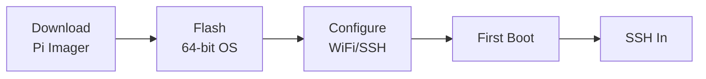
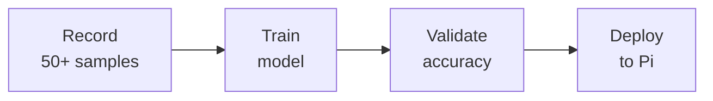
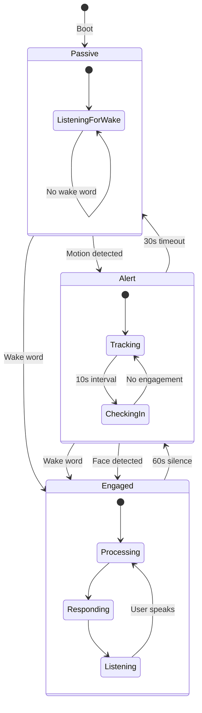
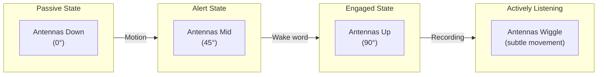

# Phase 2 Preparation Guide

This guide prepares you for Phase 2: Hardware Integration. Complete these steps before assembling your Reachy Mini to ensure a smooth transition from simulation to physical hardware.

## Phase 2 Overview

```mermaid
gantt
    title Phase 2: Hardware Integration
    dateFormat X
    axisFormat %s

    section Pi Setup
    Install Raspberry Pi OS       :a1, 0, 1
    Install Reachy Daemon         :a2, after a1, 2
    Install Claude Code CLI       :a3, after a1, 2
    Install Python Dependencies   :a4, after a3, 2
    Configure systemd             :a5, after a4, 1

    section Wake Word
    Install OpenWakeWord          :b1, after a4, 2
    Audio Capture Module          :b2, after b1, 3
    Wake Word Detector            :b3, after b2, 3
    Sensitivity Tuning            :b4, after b3, 2

    section Attention
    State Machine Model           :c1, after a5, 2
    Passive Mode                  :c2, after c1, 2
    Alert Mode                    :c3, after c2, 2
    Engaged Mode                  :c4, after c3, 2

    section Privacy
    Antenna Indicators            :d1, after c4, 2
    Audio Cues                    :d2, after d1, 2
```



## Pre-Assembly Checklist

### Hardware Requirements

| Component | Specification | Notes |
|-----------|--------------|-------|
| Reachy Mini | Wireless version | Includes Raspberry Pi 4 |
| MicroSD Card | 32GB+ Class 10 | For Raspberry Pi OS |
| USB-C Power | 5V/3A | For Raspberry Pi |
| WiFi Network | 2.4GHz or 5GHz | For cloud connectivity |

### Software Prerequisites (Development Machine)

Verify these work in simulation before moving to hardware:

```bash
# 1. Run full test suite
pytest -v
# Expected: 113+ tests pass

# 2. Run simulation validation
python scripts/validate_simulation.py --headless
# Expected: ALL TESTS PASSED

# 3. Verify MCP server starts
python -c "from reachy_agent.mcp_servers.reachy import create_reachy_mcp_server; print('OK')"
# Expected: OK

# 4. Verify GitHub MCP integration (optional)
python -c "from reachy_agent.mcp_servers.integrations import is_binary_available; print('Binary:', is_binary_available())"
# Expected: Binary: True (if installed) or False

# 5. Verify agent loop
python -c "from reachy_agent.agent import ReachyAgentLoop; print('OK')"
# Expected: OK
```

### Environment Variables

Ensure `.env` is configured with your API keys:

```bash
# Required for Phase 2
ANTHROPIC_API_KEY=sk-ant-api03-...  # Claude API
REACHY_DAEMON_URL=http://localhost:8000  # Local daemon

# Optional (Phase 3+)
HA_URL=http://homeassistant.local:8123
HA_TOKEN=eyJ...
GITHUB_TOKEN=ghp_...
```

## Raspberry Pi Setup

### Step 1: Install Raspberry Pi OS



1. Download [Raspberry Pi Imager](https://www.raspberrypi.com/software/)
2. Select **Raspberry Pi OS (64-bit)**
3. Click gear icon for advanced options:
   - Enable SSH
   - Set hostname: `reachy-mini`
   - Configure WiFi credentials
   - Set username/password
4. Flash to MicroSD card
5. Insert card into Pi and boot

```bash
# SSH into Pi
ssh pi@reachy-mini.local

# Update system
sudo apt update && sudo apt upgrade -y
```

### Step 2: Install Reachy Daemon

The Reachy daemon comes pre-installed on Reachy Mini. Verify it's running:

```bash
# Check daemon status
sudo systemctl status reachy-daemon

# If not running, start it
sudo systemctl start reachy-daemon
sudo systemctl enable reachy-daemon

# Verify API is accessible
curl http://localhost:8000/api/daemon/status
```

Expected response:
```json
{
  "robot_name": "reachy_mini",
  "state": "running",
  "simulation_enabled": false
}
```

### Step 3: Install Python Environment

```bash
# Install uv (fast package manager)
curl -LsSf https://astral.sh/uv/install.sh | sh
source ~/.bashrc

# Clone repository
git clone https://github.com/jawhnycooke/reachy-agent.git
cd reachy-agent

# Create virtual environment
uv venv
source .venv/bin/activate

# Install dependencies
uv pip install -r requirements.txt

# Verify installation
python -c "import reachy_agent; print('OK')"
```

### Step 3.5: Install GitHub MCP (Optional)

For GitHub integration (repos, issues, PRs, actions):

```bash
# Download ARM64 binary (only 4MB)
mkdir -p ~/.reachy/bin
curl -sL https://github.com/github/github-mcp-server/releases/latest/download/github-mcp-server_Linux_arm64.tar.gz | tar xzf - -C ~/.reachy/bin
chmod +x ~/.reachy/bin/github-mcp-server

# Verify
~/.reachy/bin/github-mcp-server --version

# Add token to .env
echo "GITHUB_TOKEN=ghp_your_token_here" >> ~/.reachy/.env
```

The agent automatically detects the binary at `~/.reachy/bin/github-mcp-server` and uses it instead of Docker.

### Step 4: Configure systemd Service

Create the service file:

```bash
sudo nano /etc/systemd/system/reachy-agent.service
```

Content:
```ini
[Unit]
Description=Reachy Agent - Claude-powered robot
After=network.target reachy-daemon.service
Requires=reachy-daemon.service

[Service]
Type=simple
User=pi
WorkingDirectory=/home/pi/reachy-agent
Environment=PATH=/home/pi/reachy-agent/.venv/bin
EnvironmentFile=/home/pi/reachy-agent/.env
ExecStart=/home/pi/reachy-agent/.venv/bin/python -m reachy_agent run
Restart=on-failure
RestartSec=10

[Install]
WantedBy=multi-user.target
```

Enable and start:
```bash
sudo systemctl daemon-reload
sudo systemctl enable reachy-agent
sudo systemctl start reachy-agent

# Check status
sudo systemctl status reachy-agent
journalctl -u reachy-agent -f
```

## Audio System Setup

### Microphone Array

Reachy Mini has a 4-microphone array. Verify it's detected:

```bash
# List audio devices
arecord -l

# Expected output:
# card 1: ReachyMini [Reachy Mini], device 0: USB Audio [USB Audio]
#   Subdevices: 1/1

# Test recording
arecord -D plughw:1,0 -f cd -d 5 test.wav
aplay test.wav
```

### Speaker

```bash
# List playback devices
aplay -l

# Test speaker
speaker-test -D plughw:1,0 -c 2 -t wav
```

### PyAudio Configuration

```python
# Verify PyAudio works
import pyaudio

p = pyaudio.PyAudio()
for i in range(p.get_device_count()):
    info = p.get_device_info_by_index(i)
    print(f"{i}: {info['name']} (inputs: {info['maxInputChannels']})")
```

## Wake Word Detection

### OpenWakeWord Setup

```bash
# Install OpenWakeWord
pip install openwakeword

# Download models
python -c "import openwakeword; openwakeword.utils.download_models()"
```

### Custom Wake Word

We'll use "Hey Reachy" as the wake phrase. OpenWakeWord supports custom training:



For now, use a similar built-in model as placeholder:

```python
from openwakeword import Model

# Load model (using "hey jarvis" as placeholder)
model = Model(wakeword_models=["hey_jarvis_v0.1"])

# Test detection
import pyaudio
import numpy as np

p = pyaudio.PyAudio()
stream = p.open(format=pyaudio.paInt16, channels=1, rate=16000,
                input=True, frames_per_buffer=1280)

while True:
    audio = np.frombuffer(stream.read(1280), dtype=np.int16)
    prediction = model.predict(audio)
    if prediction["hey_jarvis_v0.1"] > 0.5:
        print("Wake word detected!")
```

## Attention State Machine

### State Diagram



### Implementation Skeleton

```python
# src/reachy_agent/attention/states.py

from enum import Enum, auto
from dataclasses import dataclass
from typing import Callable
import asyncio

class AttentionState(Enum):
    PASSIVE = auto()   # Minimal CPU, wake word only
    ALERT = auto()     # Motion tracking, periodic check-ins
    ENGAGED = auto()   # Full agent loop active

@dataclass
class AttentionConfig:
    alert_timeout: float = 30.0      # Seconds before Alert → Passive
    engaged_timeout: float = 60.0    # Seconds before Engaged → Alert
    checkin_interval: float = 10.0   # Seconds between Alert check-ins

class AttentionStateMachine:
    def __init__(
        self,
        config: AttentionConfig,
        on_state_change: Callable[[AttentionState], None] | None = None,
    ):
        self.config = config
        self.state = AttentionState.PASSIVE
        self.on_state_change = on_state_change
        self._timeout_task: asyncio.Task | None = None

    async def transition(self, new_state: AttentionState) -> None:
        if new_state == self.state:
            return

        old_state = self.state
        self.state = new_state

        # Cancel existing timeout
        if self._timeout_task:
            self._timeout_task.cancel()

        # Set new timeout based on state
        if new_state == AttentionState.ALERT:
            self._timeout_task = asyncio.create_task(
                self._timeout(self.config.alert_timeout, AttentionState.PASSIVE)
            )
        elif new_state == AttentionState.ENGAGED:
            self._timeout_task = asyncio.create_task(
                self._timeout(self.config.engaged_timeout, AttentionState.ALERT)
            )

        if self.on_state_change:
            self.on_state_change(new_state)

    async def _timeout(self, seconds: float, target: AttentionState) -> None:
        await asyncio.sleep(seconds)
        await self.transition(target)

    # Event handlers
    async def on_wake_word(self) -> None:
        await self.transition(AttentionState.ENGAGED)

    async def on_motion_detected(self) -> None:
        if self.state == AttentionState.PASSIVE:
            await self.transition(AttentionState.ALERT)

    async def on_face_detected(self) -> None:
        await self.transition(AttentionState.ENGAGED)

    async def on_user_speaking(self) -> None:
        if self.state == AttentionState.ENGAGED:
            # Reset timeout
            await self.transition(AttentionState.ENGAGED)
```

## Privacy Indicators

### Antenna States



### Implementation

```python
# src/reachy_agent/privacy/indicators.py

from reachy_agent.simulation import ReachyMiniClient
from reachy_agent.attention.states import AttentionState

class PrivacyIndicator:
    def __init__(self, client: ReachyMiniClient):
        self.client = client

    async def set_state(self, state: AttentionState) -> None:
        """Update antenna positions to reflect attention state."""
        match state:
            case AttentionState.PASSIVE:
                await self.client.set_antenna_state(
                    left_angle=0, right_angle=0
                )
            case AttentionState.ALERT:
                await self.client.set_antenna_state(
                    left_angle=45, right_angle=45
                )
            case AttentionState.ENGAGED:
                await self.client.set_antenna_state(
                    left_angle=90, right_angle=90
                )

    async def indicate_listening(self) -> None:
        """Subtle wiggle to show active recording."""
        for _ in range(2):
            await self.client.set_antenna_state(left_angle=85, right_angle=95)
            await asyncio.sleep(0.2)
            await self.client.set_antenna_state(left_angle=95, right_angle=85)
            await asyncio.sleep(0.2)
        await self.client.set_antenna_state(left_angle=90, right_angle=90)
```

## Thermal Management

The Raspberry Pi 4 can throttle under load. Monitor and manage thermals:

```bash
# Check temperature
vcgencmd measure_temp

# Install monitoring
sudo apt install lm-sensors htop

# Add cooling if needed (fan, heatsink)
```

### Thermal Thresholds

| Temperature | Action |
|-------------|--------|
| < 60°C | Normal operation |
| 60-70°C | Reduce background tasks |
| 70-80°C | Throttle Claude API calls |
| > 80°C | Enter sleep mode |

## Network Configuration

### Static IP (Recommended)

```bash
sudo nano /etc/dhcpcd.conf
```

Add:
```
interface wlan0
static ip_address=192.168.1.100/24
static routers=192.168.1.1
static domain_name_servers=192.168.1.1 8.8.8.8
```

### Firewall

```bash
# Allow SSH
sudo ufw allow ssh

# Allow local Reachy daemon
sudo ufw allow from 127.0.0.1 to any port 8000

# Enable firewall
sudo ufw enable
```

## Testing on Hardware

### Quick Validation

```bash
# 1. Check daemon
curl http://localhost:8000/api/daemon/status

# 2. Test head movement
curl -X POST http://localhost:8000/api/move/goto \
  -H "Content-Type: application/json" \
  -d '{"head_pose": {"yaw": 0.5}, "duration": 1.0}'

# 3. Run agent validation (adapted for hardware)
python scripts/validate_hardware.py
```

### Integration Test

```python
# scripts/validate_hardware.py

import asyncio
from reachy_agent.simulation import ReachyMiniClient

async def validate():
    client = ReachyMiniClient(base_url="http://localhost:8000")

    print("Testing wake_up...")
    await client.wake_up()
    await asyncio.sleep(1)

    print("Testing head movement...")
    await client.move_head("left", speed="normal")
    await asyncio.sleep(1)
    await client.move_head("right", speed="normal")
    await asyncio.sleep(1)

    print("Testing antennas...")
    await client.set_antenna_state(90, 90)
    await asyncio.sleep(0.5)
    await client.set_antenna_state(0, 0)

    print("Testing gestures...")
    await client.nod(times=2)
    await asyncio.sleep(2)

    print("Returning to rest...")
    await client.rest()

    await client.close()
    print("ALL TESTS PASSED!")

asyncio.run(validate())
```

## Troubleshooting

### Daemon Not Responding

```bash
# Check if running
sudo systemctl status reachy-daemon

# Restart
sudo systemctl restart reachy-daemon

# Check logs
journalctl -u reachy-daemon -n 50
```

### Motors Not Moving

```bash
# Check motor power
curl http://localhost:8000/api/daemon/status | jq .backend_status

# Wake up robot first
curl -X POST http://localhost:8000/api/move/play/wake_up
```

### Audio Issues

```bash
# Check ALSA
arecord -l
aplay -l

# Fix permissions
sudo usermod -a -G audio pi
```

### Network Connectivity

```bash
# Check WiFi
iwconfig wlan0

# Test Claude API
curl https://api.anthropic.com/v1/messages \
  -H "x-api-key: $ANTHROPIC_API_KEY" \
  -H "anthropic-version: 2024-01-01" \
  -H "content-type: application/json" \
  -d '{"model": "claude-sonnet-4-20250514", "max_tokens": 10, "messages": [{"role": "user", "content": "Hi"}]}'
```

## Phase 2 Completion Checklist

Before moving to Phase 3, verify:

- [ ] Raspberry Pi OS installed and updated
- [ ] Reachy daemon running and responsive
- [ ] reachy-agent systemd service enabled
- [ ] All hardware tests pass
- [ ] Audio input/output working
- [ ] Wake word detection functional
- [ ] Attention state machine implemented
- [ ] Privacy indicators working
- [ ] Thermal monitoring in place
- [ ] Network stable

## Next Steps

After completing Phase 2:

1. **Phase 3: Memory & Personality** - ChromaDB, long-term memory, expression system
2. **Phase 4: External Integrations** - Home Assistant, Calendar, GitHub MCP servers
