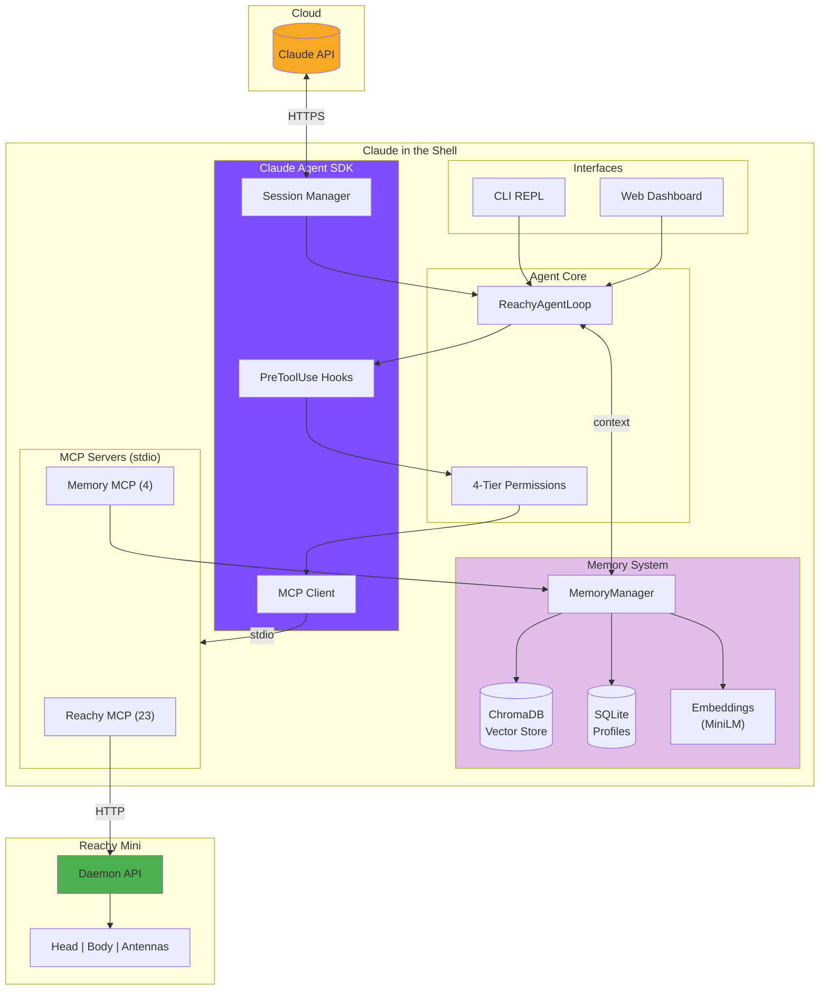

# Claude in the Shell

An embodied AI agent for the Reachy Mini desktop robot, powered by Claude Agent SDK and MCP.

> *"Your ghost, my shell."* - Inspired by Ghost in the Shell

## Overview

Claude in the Shell transforms your Reachy Mini into an autonomous AI assistant that can:

- Respond to voice commands with "Hey Reachy" wake word
- Control its head, body, and antennas expressively
- See through its camera and respond to visual cues
- Remember context across conversations
- Connect to external services via MCP (Home Assistant, Calendar, GitHub, etc.)

## Quick Start

```bash
# Clone and setup
git clone https://github.com/jawhnycooke/claude-in-the-shell.git
cd claude-in-the-shell
uv venv && source .venv/bin/activate
uv pip install -r requirements.txt

# Run with mock daemon (no hardware needed)
python -m reachy_agent run --mock
```

For detailed setup instructions, see the [Getting Started Tutorial](tutorials/getting-started.md).

## Architecture



## Features

### 27 MCP Tools

The agent exposes robot control and memory via two MCP servers:

| Server | Tools | Description |
|--------|-------|-------------|
| **Reachy** | 23 | Movement, expressions, audio, perception, lifecycle |
| **Memory** | 4 | Semantic search, memory storage, user profiles |

See [MCP Tools Reference](api/mcp-tools.md) for complete documentation.

### 4-Tier Permission System

| Tier | Behavior | Examples |
|------|----------|----------|
| 1. Autonomous | Execute immediately | Body control, reading data |
| 2. Notify | Execute and inform | Smart home control |
| 3. Confirm | Ask before executing | Creating events, PRs |
| 4. Forbidden | Never execute | Security-critical ops |

### Multiple Interfaces

- **CLI REPL**: Rich terminal interface with slash commands
- **Web Dashboard**: Browser-based chat with video streaming
- **API**: Programmatic access for integrations

## Project Status

**Phase 1: Foundation** - Complete

- Agent loop with Claude SDK
- 23 Reachy MCP tools + 4 Memory tools
- Permission system with SDK hooks
- CLI, Web, and API interfaces
- MuJoCo simulation support

**Phase 2: Hardware** - Next

- Raspberry Pi environment
- Wake word detection
- Attention state machine

## Documentation

<div class="grid cards" markdown>

-   :material-rocket-launch:{ .lg .middle } **Getting Started**

    ---

    Set up your development environment and run your first demo.

    [:octicons-arrow-right-24: Tutorial](tutorials/getting-started.md)

-   :material-sitemap:{ .lg .middle } **Architecture**

    ---

    Understand the system design and component relationships.

    [:octicons-arrow-right-24: Overview](architecture/overview.md)

-   :material-api:{ .lg .middle } **API Reference**

    ---

    Auto-generated documentation from source code.

    [:octicons-arrow-right-24: Reference](api/agent.md)

-   :material-wrench:{ .lg .middle } **Troubleshooting**

    ---

    Common issues and their solutions.

    [:octicons-arrow-right-24: Guide](guides/troubleshooting.md)

</div>

## Development

```bash
# Install dev dependencies
uv pip install -r requirements-dev.txt

# Run tests
pytest -v

# Format and lint
uvx black . && uvx isort . && uvx ruff check .

# Build documentation
mkdocs serve
```

## License

MIT

## Links

- [GitHub Repository](https://github.com/jawhnycooke/claude-in-the-shell)
- [Reachy Mini SDK](https://github.com/pollen-robotics/reachy_mini)
- [Claude Agent SDK](https://github.com/anthropics/claude-agent-sdk-python)
- [MCP Python SDK](https://github.com/modelcontextprotocol/python-sdk)
