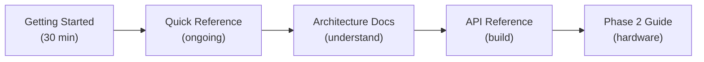

# Tutorials

Learning-oriented guides for getting started with Reachy Agent development.

## Available Tutorials

### [Getting Started](getting-started.md)
**Time: ~30 minutes** | **Skill Level: Beginner**

A complete walkthrough from zero to controlling a simulated Reachy robot with AI. Covers:
- Environment setup (Python, uv, virtual environment)
- MuJoCo simulation installation (macOS)
- Your first robot commands
- Running the validation suite
- Claude Agent SDK integration

### [Quick Reference](quick-reference.md)
**Time: Reference** | **Skill Level: Any**

A cheat sheet for common commands and API patterns. Use this as a daily reference once you've completed the Getting Started tutorial.

## Learning Path



## Prerequisites

Before starting the tutorials, ensure you have:

- **macOS** (Apple Silicon M1/M2/M3 or Intel) or **Linux**
- **Python 3.10+** installed
- **Homebrew** (macOS only) - [brew.sh](https://brew.sh)
- Basic familiarity with the command line

## What You'll Build

By following these tutorials, you'll create a development environment where:

1. A physics simulation runs the Reachy Mini robot in MuJoCo
2. Your Python code sends commands to control the robot
3. Claude AI can reason about and execute robot movements
4. All MCP (Model Context Protocol) tools are validated and working

```
Your Code ─→ MCP Tools ─→ HTTP API ─→ MuJoCo ─→ 🤖 Robot
                ↑
           Claude AI
```

## Next Steps After Tutorials

Once you've completed the tutorials:

1. **Explore the codebase** - Read `src/reachy_agent/simulation/reachy_client.py`
2. **Create custom expressions** - Modify `scripts/live_demo.py`
3. **Understand permissions** - Read `docs/api/mcp-tools.md`
4. **Prepare for hardware** - Follow `docs/guides/phase2-preparation.md`

## Feedback

Found an issue with a tutorial? Have suggestions for improvement?
Please open an issue on the repository.
